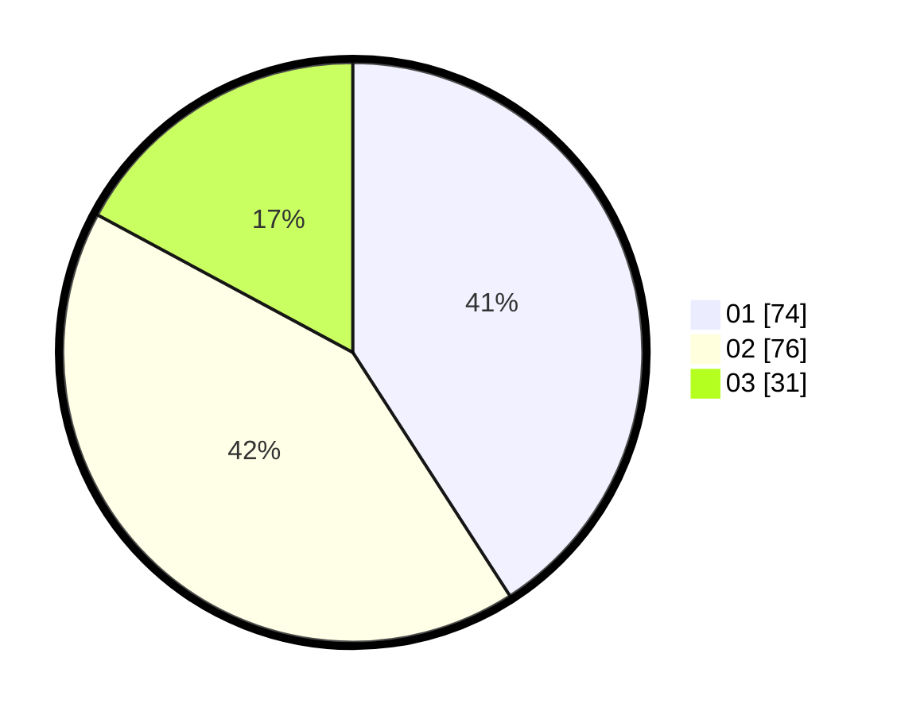

# Hasil

Hasil perolehan suara paslon dapat dilihat pada file paslon-01.txt, paslon-02.txt, dan paslon-03.txt.

Jika tidak ada, artinya data tersebut belum ada pada SIREKAP.

## Perolehan Suara

 * Paslon 01: **74**.
 * Paslon 02: **76**.
 * Paslon 03: **31**.

## Foto C Plano

https://sirekap-obj-formc.kpu.go.id/f307/pemilu/ppwp/31/71/05/10/01/3171051001006-20240214-155208--ac259acb-04ac-4494-9b22-8706cb5e4949.jpg

https://sirekap-obj-formc.kpu.go.id/f307/pemilu/ppwp/31/71/05/10/01/3171051001006-20240214-155311--3fae765e-7026-448f-a10b-beb8523eb8a8.jpg

https://sirekap-obj-formc.kpu.go.id/f307/pemilu/ppwp/31/71/05/10/01/3171051001006-20240214-155358--d54f9cc6-97fa-4bc5-95d6-eb04d02cc0a4.jpg

## DATA PEMILIH TETAP

Jumlah pemilih dalam DPT: **251**.
 * L: **111**.
 * P: **140**.

## DATA PENGGUNA HAK PILIH

Jumlah pengguna hak pilih dalam DPT: **182**.
 * L: **84**.
 * P: **98**.

Jumlah pengguna hak pilih dalam DPTb: **3**.
 * L: **1**.
 * P: **2**.

Jumlah pengguna hak pilih dalam DPK: **2**.
 * L: **1**.
 * P: **1**.

Jumlah pengguna hak pilih: **187**.
 * L: **86**.
 * P: **101**.

## JUMLAH SUARA SAH DAN TIDAK SAH

JUMLAH SELURUH SUARA SAH: **181**.

JUMLAH SUARA TIDAK SAH: **6**.

JUMLAH SELURUH SUARA SAH DAN SUARA TIDAK SAH: **187**.
