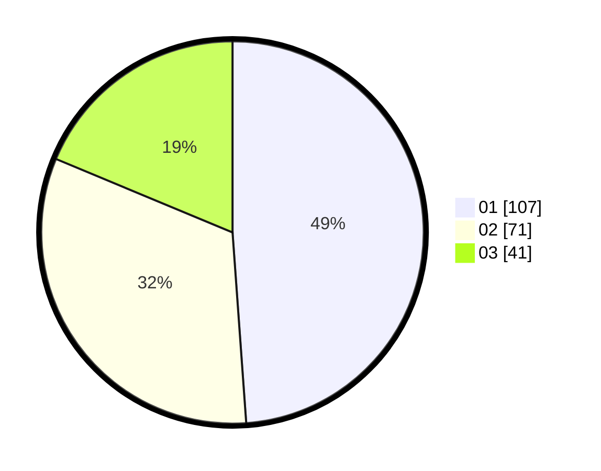

# Hasil

Hasil perolehan suara paslon dapat dilihat pada file paslon-01.txt, paslon-02.txt, dan paslon-03.txt.

Jika tidak ada, artinya data tersebut belum ada pada SIREKAP.

## Perolehan Suara

 * Paslon 01: **107**.
 * Paslon 02: **71**.
 * Paslon 03: **41**.

## Foto C Plano

https://sirekap-obj-formc.kpu.go.id/332d/pemilu/ppwp/31/71/05/10/01/3171051001009-20240216-113209--7a41cf17-729b-418a-a860-54530e96e4f0.jpg

https://sirekap-obj-formc.kpu.go.id/332d/pemilu/ppwp/31/71/05/10/01/3171051001009-20240216-113211--f8e77eaf-c66f-46ca-b52b-fe58e745ef1e.jpg

https://sirekap-obj-formc.kpu.go.id/332d/pemilu/ppwp/31/71/05/10/01/3171051001009-20240216-113210--43a2eeb0-fe1b-415a-99fe-a1e13abf839d.jpg

## DATA PEMILIH TETAP

Jumlah pemilih dalam DPT: **293**.
 * L: **136**.
 * P: **157**.

## DATA PENGGUNA HAK PILIH

Jumlah pengguna hak pilih dalam DPT: **225**.
 * L: **102**.
 * P: **123**.

Jumlah pengguna hak pilih dalam DPTb: **2**.
 * L: **0**.
 * P: **2**.

Jumlah pengguna hak pilih dalam DPK: **1**.
 * L: **0**.
 * P: **1**.

Jumlah pengguna hak pilih: **228**.
 * L: **102**.
 * P: **126**.

## JUMLAH SUARA SAH DAN TIDAK SAH

JUMLAH SELURUH SUARA SAH: **219**.

JUMLAH SUARA TIDAK SAH: **9**.

JUMLAH SELURUH SUARA SAH DAN SUARA TIDAK SAH: **228**.
