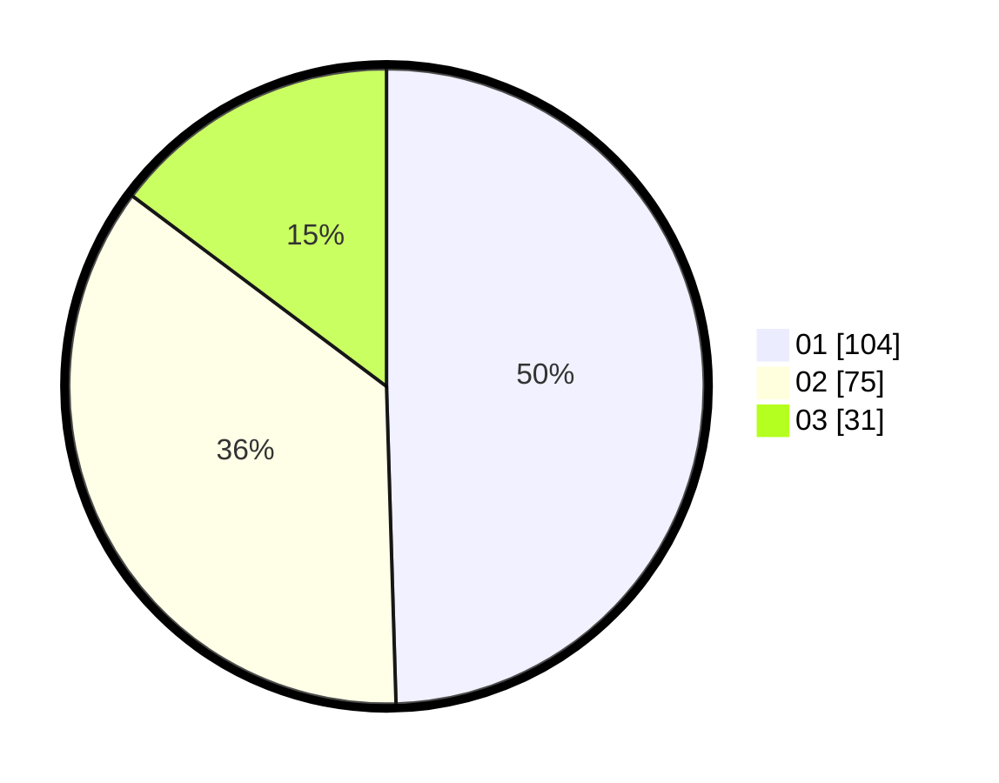

# Hasil

Hasil perolehan suara paslon dapat dilihat pada file paslon-01.txt, paslon-02.txt, dan paslon-03.txt.

Jika tidak ada, artinya data tersebut belum ada pada SIREKAP.

## Perolehan Suara

 * Paslon 01: **104**.
 * Paslon 02: **75**.
 * Paslon 03: **31**.

## Foto C Plano

https://sirekap-obj-formc.kpu.go.id/d3e5/pemilu/ppwp/31/71/05/10/01/3171051001016-20240215-205251--a8b828c1-1c84-44ef-876a-6f29a0aa7516.jpg

https://sirekap-obj-formc.kpu.go.id/d3e5/pemilu/ppwp/31/71/05/10/01/3171051001016-20240215-205256--88df8427-cd50-4573-9096-230d31f2b597.jpg

https://sirekap-obj-formc.kpu.go.id/d3e5/pemilu/ppwp/31/71/05/10/01/3171051001016-20240215-205254--51cae712-7aed-4560-9d28-a5530e14bf50.jpg

## DATA PEMILIH TETAP

Jumlah pemilih dalam DPT: **293**.
 * L: **148**.
 * P: **145**.

## DATA PENGGUNA HAK PILIH

Jumlah pengguna hak pilih dalam DPT: **287**.
 * L: **145**.
 * P: **142**.

Jumlah pengguna hak pilih dalam DPTb: **4**.
 * L: **2**.
 * P: **2**.

Jumlah pengguna hak pilih dalam DPK: **2**.
 * L: **1**.
 * P: **1**.

Jumlah pengguna hak pilih: **293**.
 * L: **148**.
 * P: **145**.

## JUMLAH SUARA SAH DAN TIDAK SAH

JUMLAH SELURUH SUARA SAH: **210**.

JUMLAH SUARA TIDAK SAH: **2**.

JUMLAH SELURUH SUARA SAH DAN SUARA TIDAK SAH: **212**.
