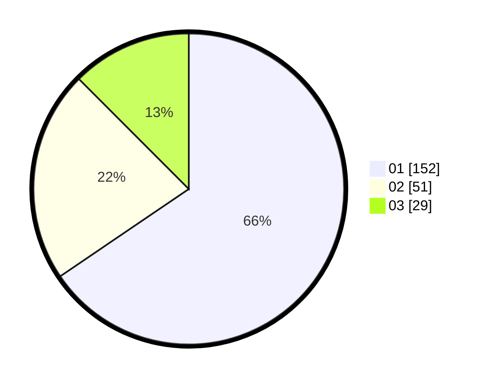

# Hasil

Hasil perolehan suara paslon dapat dilihat pada file paslon-01.txt, paslon-02.txt, dan paslon-03.txt.

Jika tidak ada, artinya data tersebut belum ada pada SIREKAP.

## Perolehan Suara

 * Paslon 01: **152**.
 * Paslon 02: **51**.
 * Paslon 03: **29**.

## Foto C Plano

https://sirekap-obj-formc.kpu.go.id/cc8a/pemilu/ppwp/31/71/05/10/01/3171051001021-20240216-145949--ca5ad406-d22b-4316-8acb-bee2ef658b0c.jpg

https://sirekap-obj-formc.kpu.go.id/cc8a/pemilu/ppwp/31/71/05/10/01/3171051001021-20240216-145950--c8f107a4-e5a3-473e-98e1-c64c4e7c7de3.jpg

https://sirekap-obj-formc.kpu.go.id/cc8a/pemilu/ppwp/31/71/05/10/01/3171051001021-20240216-145949--0eda6192-552e-4156-a746-ee401e8f0f88.jpg

## DATA PEMILIH TETAP

Jumlah pemilih dalam DPT: **283**.
 * L: **131**.
 * P: **152**.

## DATA PENGGUNA HAK PILIH

Jumlah pengguna hak pilih dalam DPT: **224**.
 * L: **100**.
 * P: **124**.

Jumlah pengguna hak pilih dalam DPTb: **9**.
 * L: **1**.
 * P: **8**.

Jumlah pengguna hak pilih dalam DPK: **1**.
 * L: **1**.
 * P: **0**.

Jumlah pengguna hak pilih: **234**.
 * L: **101**.
 * P: **132**.

## JUMLAH SUARA SAH DAN TIDAK SAH

JUMLAH SELURUH SUARA SAH: **232**.

JUMLAH SUARA TIDAK SAH: **2**.

JUMLAH SELURUH SUARA SAH DAN SUARA TIDAK SAH: **234**.
