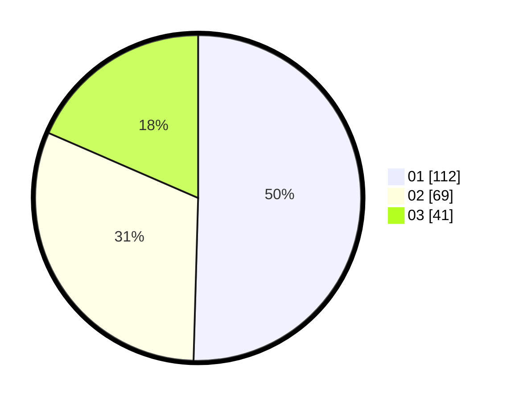

# Hasil

Hasil perolehan suara paslon dapat dilihat pada file paslon-01.txt, paslon-02.txt, dan paslon-03.txt.

Jika tidak ada, artinya data tersebut belum ada pada SIREKAP.

## Perolehan Suara

 * Paslon 01: **112**.
 * Paslon 02: **69**.
 * Paslon 03: **41**.

## Foto C Plano

https://sirekap-obj-formc.kpu.go.id/d868/pemilu/ppwp/31/71/05/10/01/3171051001024-20240214-185413--61052866-ef04-4c11-beac-607bcdada4b5.jpg

https://sirekap-obj-formc.kpu.go.id/d868/pemilu/ppwp/31/71/05/10/01/3171051001024-20240214-155458--a9c007c1-ba24-4ccb-8c0a-4c7c3d255b56.jpg

https://sirekap-obj-formc.kpu.go.id/d868/pemilu/ppwp/31/71/05/10/01/3171051001024-20240214-185416--4c6f7132-aa1a-449b-b5c8-7a4fc721474b.jpg

## DATA PEMILIH TETAP

Jumlah pemilih dalam DPT: **230**.
 * L: **133**.
 * P: **147**.

## DATA PENGGUNA HAK PILIH

Jumlah pengguna hak pilih dalam DPT: **213**.
 * L: **101**.
 * P: **112**.

Jumlah pengguna hak pilih dalam DPTb: **6**.
 * L: **2**.
 * P: **4**.

Jumlah pengguna hak pilih dalam DPK: **5**.
 * L: **3**.
 * P: **2**.

Jumlah pengguna hak pilih: **224**.
 * L: **106**.
 * P: **118**.

## JUMLAH SUARA SAH DAN TIDAK SAH

JUMLAH SELURUH SUARA SAH: **222**.

JUMLAH SUARA TIDAK SAH: **2**.

JUMLAH SELURUH SUARA SAH DAN SUARA TIDAK SAH: **224**.
