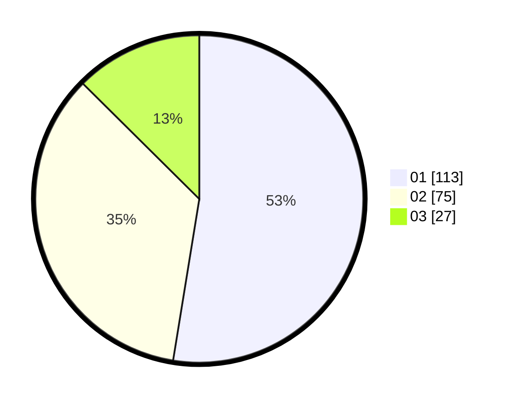

# Hasil

Hasil perolehan suara paslon dapat dilihat pada file paslon-01.txt, paslon-02.txt, dan paslon-03.txt.

Jika tidak ada, artinya data tersebut belum ada pada SIREKAP.

## Perolehan Suara

 * Paslon 01: **113**.
 * Paslon 02: **75**.
 * Paslon 03: **27**.

## Foto C Plano

https://sirekap-obj-formc.kpu.go.id/ccf2/pemilu/ppwp/31/71/05/10/01/3171051001025-20240216-072136--b44843d9-2f58-4ed3-90da-bfaf94e781aa.jpg

https://sirekap-obj-formc.kpu.go.id/ccf2/pemilu/ppwp/31/71/05/10/01/3171051001025-20240216-072144--1e200ec6-65f9-4758-9b52-da143e39a27c.jpg

https://sirekap-obj-formc.kpu.go.id/ccf2/pemilu/ppwp/31/71/05/10/01/3171051001025-20240216-072138--8fabf16b-fd5e-4ae9-9c82-1f2814e9d833.jpg

## DATA PEMILIH TETAP

Jumlah pemilih dalam DPT: **279**.
 * L: **130**.
 * P: **149**.

## DATA PENGGUNA HAK PILIH

Jumlah pengguna hak pilih dalam DPT: **213**.
 * L: **92**.
 * P: **121**.

Jumlah pengguna hak pilih dalam DPTb: **2**.
 * L: **1**.
 * P: **1**.

Jumlah pengguna hak pilih dalam DPK: **4**.
 * L: **3**.
 * P: **1**.

Jumlah pengguna hak pilih: **219**.
 * L: **96**.
 * P: **123**.

## JUMLAH SUARA SAH DAN TIDAK SAH

JUMLAH SELURUH SUARA SAH: **215**.

JUMLAH SUARA TIDAK SAH: **4**.

JUMLAH SELURUH SUARA SAH DAN SUARA TIDAK SAH: **219**.
