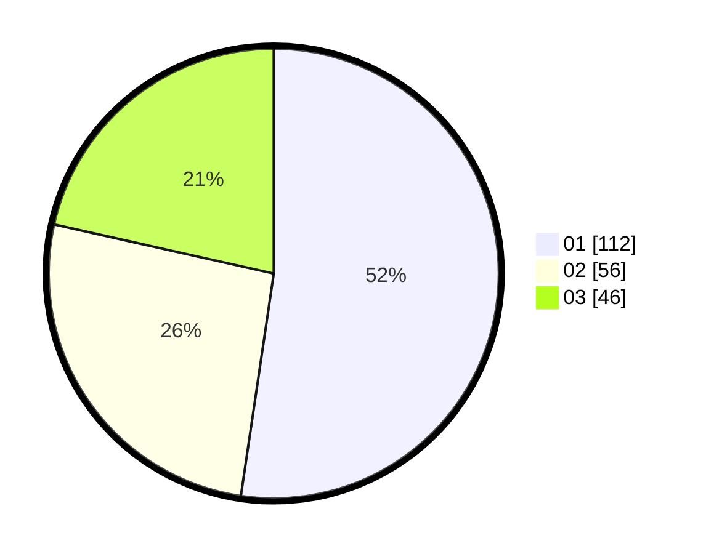

# Hasil

Hasil perolehan suara paslon dapat dilihat pada file paslon-01.txt, paslon-02.txt, dan paslon-03.txt.

Jika tidak ada, artinya data tersebut belum ada pada SIREKAP.

## Perolehan Suara

 * Paslon 01: **112**.
 * Paslon 02: **56**.
 * Paslon 03: **46**.

## Foto C Plano

https://sirekap-obj-formc.kpu.go.id/6a5b/pemilu/ppwp/31/71/05/10/01/3171051001033-20240215-232807--d652eb93-f198-4c16-b9f2-349de1e456c4.jpg

https://sirekap-obj-formc.kpu.go.id/6a5b/pemilu/ppwp/31/71/05/10/01/3171051001033-20240215-232809--98142bf0-0e22-4118-a019-0429ab9ac47c.jpg

https://sirekap-obj-formc.kpu.go.id/6a5b/pemilu/ppwp/31/71/05/10/01/3171051001033-20240215-232808--3cc7e8f5-7040-4d85-9b78-1159de2c6543.jpg

## DATA PEMILIH TETAP

Jumlah pemilih dalam DPT: **277**.
 * L: **143**.
 * P: **134**.

## DATA PENGGUNA HAK PILIH

Jumlah pengguna hak pilih dalam DPT: **204**.
 * L: **98**.
 * P: **106**.

Jumlah pengguna hak pilih dalam DPTb: **8**.
 * L: **4**.
 * P: **4**.

Jumlah pengguna hak pilih dalam DPK: **3**.
 * L: **1**.
 * P: **2**.

Jumlah pengguna hak pilih: **215**.
 * L: **103**.
 * P: **112**.

## JUMLAH SUARA SAH DAN TIDAK SAH

JUMLAH SELURUH SUARA SAH: **214**.

JUMLAH SUARA TIDAK SAH: **1**.

JUMLAH SELURUH SUARA SAH DAN SUARA TIDAK SAH: **215**.
