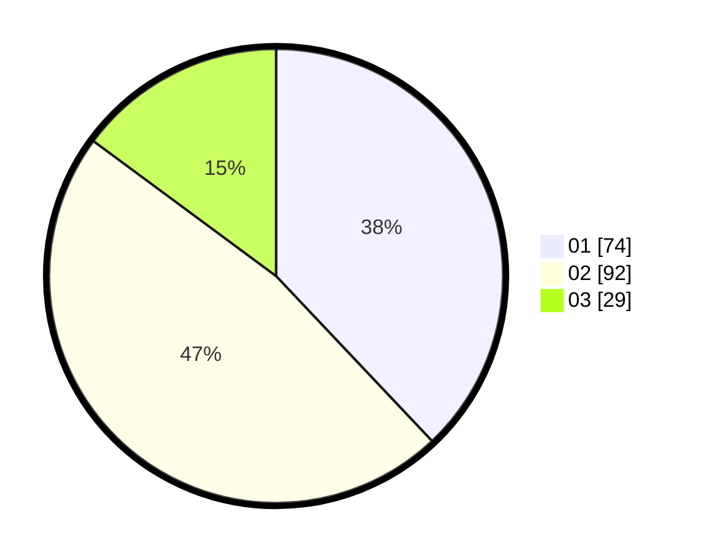

# Hasil

Hasil perolehan suara paslon dapat dilihat pada file paslon-01.txt, paslon-02.txt, dan paslon-03.txt.

Jika tidak ada, artinya data tersebut belum ada pada SIREKAP.

## Perolehan Suara

 * Paslon 01: **74**.
 * Paslon 02: **92**.
 * Paslon 03: **29**.

## Foto C Plano

https://sirekap-obj-formc.kpu.go.id/3c6a/pemilu/ppwp/31/71/05/10/01/3171051001037-20240216-020017--a87d4472-07c9-446c-a0d1-502aadf4cf07.jpg

https://sirekap-obj-formc.kpu.go.id/3c6a/pemilu/ppwp/31/71/05/10/01/3171051001037-20240216-020030--7ad96bb5-47e6-477b-810c-d7b312686d4b.jpg

https://sirekap-obj-formc.kpu.go.id/3c6a/pemilu/ppwp/31/71/05/10/01/3171051001037-20240216-020025--c29295dc-e08a-4a57-88de-e6acabd3fe92.jpg

## DATA PEMILIH TETAP

Jumlah pemilih dalam DPT: **278**.
 * L: **138**.
 * P: **140**.

## DATA PENGGUNA HAK PILIH

Jumlah pengguna hak pilih dalam DPT: **199**.
 * L: **93**.
 * P: **106**.

Jumlah pengguna hak pilih dalam DPTb: **0**.
 * L: **0**.
 * P: **0**.

Jumlah pengguna hak pilih dalam DPK: **5**.
 * L: **2**.
 * P: **3**.

Jumlah pengguna hak pilih: **204**.
 * L: **95**.
 * P: **109**.

## JUMLAH SUARA SAH DAN TIDAK SAH

JUMLAH SELURUH SUARA SAH: **195**.

JUMLAH SUARA TIDAK SAH: **9**.

JUMLAH SELURUH SUARA SAH DAN SUARA TIDAK SAH: **204**.
