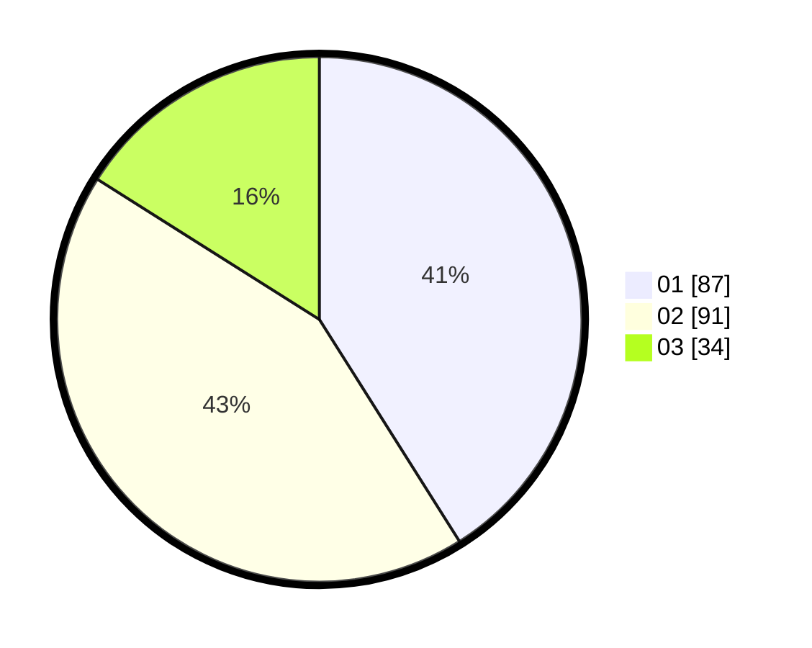

# Hasil

Hasil perolehan suara paslon dapat dilihat pada file paslon-01.txt, paslon-02.txt, dan paslon-03.txt.

Jika tidak ada, artinya data tersebut belum ada pada SIREKAP.

## Perolehan Suara

 * Paslon 01: **87**.
 * Paslon 02: **91**.
 * Paslon 03: **34**.

## Foto C Plano

https://sirekap-obj-formc.kpu.go.id/461c/pemilu/ppwp/31/71/05/10/01/3171051001040-20240216-142042--4cc13841-f887-40b3-9a33-3c805fce9f5c.jpg

https://sirekap-obj-formc.kpu.go.id/461c/pemilu/ppwp/31/71/05/10/01/3171051001040-20240216-142044--6d314d6f-c9ac-4768-a02a-db86224a18d8.jpg

https://sirekap-obj-formc.kpu.go.id/461c/pemilu/ppwp/31/71/05/10/01/3171051001040-20240216-142043--87f8e0ca-3706-4a62-a437-17e681d5b963.jpg

## DATA PEMILIH TETAP

Jumlah pemilih dalam DPT: **276**.
 * L: **132**.
 * P: **144**.

## DATA PENGGUNA HAK PILIH

Jumlah pengguna hak pilih dalam DPT: **205**.
 * L: **96**.
 * P: **109**.

Jumlah pengguna hak pilih dalam DPTb: **6**.
 * L: **5**.
 * P: **1**.

Jumlah pengguna hak pilih dalam DPK: **3**.
 * L: **2**.
 * P: **1**.

Jumlah pengguna hak pilih: **214**.
 * L: **103**.
 * P: **111**.

## JUMLAH SUARA SAH DAN TIDAK SAH

JUMLAH SELURUH SUARA SAH: **212**.

JUMLAH SUARA TIDAK SAH: **2**.

JUMLAH SELURUH SUARA SAH DAN SUARA TIDAK SAH: **214**.
