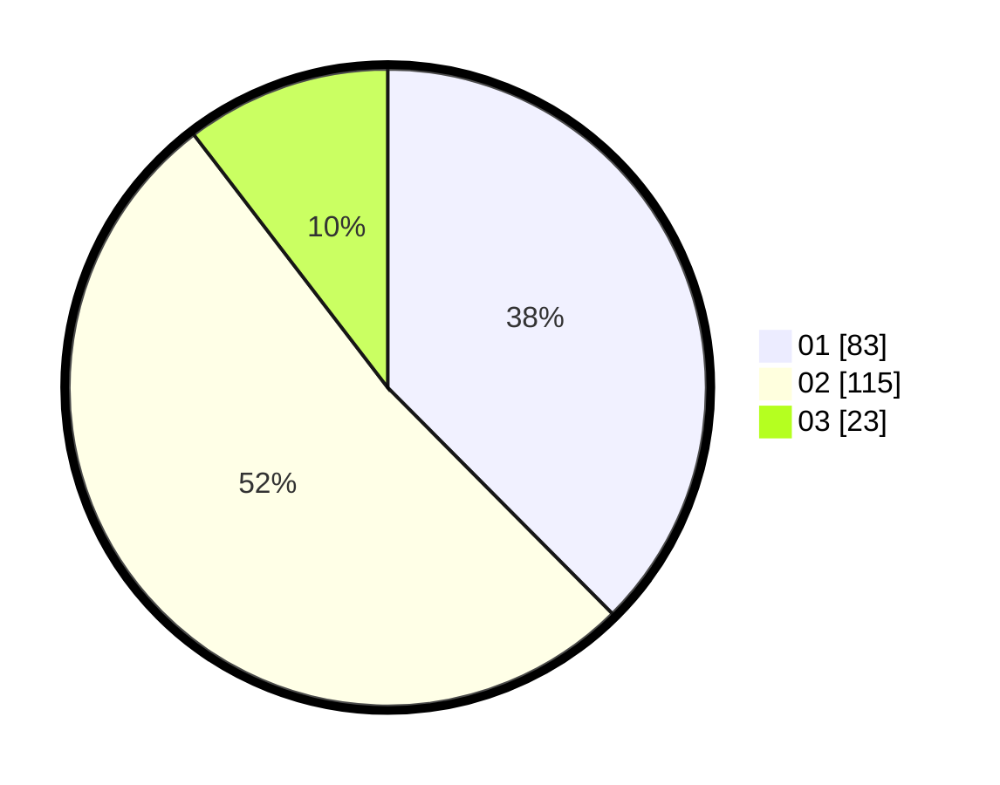

# Hasil

Hasil perolehan suara paslon dapat dilihat pada file paslon-01.txt, paslon-02.txt, dan paslon-03.txt.

Jika tidak ada, artinya data tersebut belum ada pada SIREKAP.

## Perolehan Suara

 * Paslon 01: **83**.
 * Paslon 02: **115**.
 * Paslon 03: **23**.

## Foto C Plano

https://sirekap-obj-formc.kpu.go.id/d3c9/pemilu/ppwp/31/71/05/10/01/3171051001045-20240214-191431--ff4928d2-2800-441b-af47-c0a813585967.jpg

https://sirekap-obj-formc.kpu.go.id/d3c9/pemilu/ppwp/31/71/05/10/01/3171051001045-20240214-184650--793cab23-7ccd-4058-97fa-5313c8c98fc5.jpg

https://sirekap-obj-formc.kpu.go.id/d3c9/pemilu/ppwp/31/71/05/10/01/3171051001045-20240214-184656--622051d4-9d20-4ebd-b365-d2512e0fb7e1.jpg

## DATA PEMILIH TETAP

Jumlah pemilih dalam DPT: **276**.
 * L: **134**.
 * P: **142**.

## DATA PENGGUNA HAK PILIH

Jumlah pengguna hak pilih dalam DPT: **214**.
 * L: **101**.
 * P: **113**.

Jumlah pengguna hak pilih dalam DPTb: **12**.
 * L: **6**.
 * P: **6**.

Jumlah pengguna hak pilih dalam DPK: **0**.
 * L: **0**.
 * P: **0**.

Jumlah pengguna hak pilih: **226**.
 * L: **107**.
 * P: **119**.

## JUMLAH SUARA SAH DAN TIDAK SAH

JUMLAH SELURUH SUARA SAH: **221**.

JUMLAH SUARA TIDAK SAH: **5**.

JUMLAH SELURUH SUARA SAH DAN SUARA TIDAK SAH: **226**.
