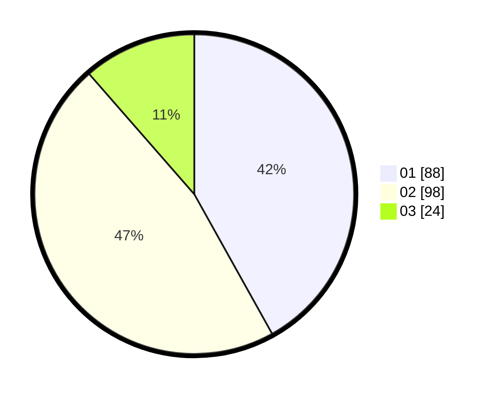

# Hasil

Hasil perolehan suara paslon dapat dilihat pada file paslon-01.txt, paslon-02.txt, dan paslon-03.txt.

Jika tidak ada, artinya data tersebut belum ada pada SIREKAP.

## Perolehan Suara

 * Paslon 01: **88**.
 * Paslon 02: **98**.
 * Paslon 03: **24**.

## Foto C Plano

https://sirekap-obj-formc.kpu.go.id/d42e/pemilu/ppwp/31/71/05/10/01/3171051001047-20240215-012959--39582190-99e9-46b4-9776-47fe4ae3fdbb.jpg

https://sirekap-obj-formc.kpu.go.id/d42e/pemilu/ppwp/31/71/05/10/01/3171051001047-20240215-013130--b60426cc-beec-4ebb-81bc-1bd8f83a1d67.jpg

https://sirekap-obj-formc.kpu.go.id/d42e/pemilu/ppwp/31/71/05/10/01/3171051001047-20240215-013416--055e847e-0899-4371-8ea0-d36dc57ad39e.jpg

## DATA PEMILIH TETAP

Jumlah pemilih dalam DPT: **275**.
 * L: **143**.
 * P: **132**.

## DATA PENGGUNA HAK PILIH

Jumlah pengguna hak pilih dalam DPT: **199**.
 * L: **101**.
 * P: **98**.

Jumlah pengguna hak pilih dalam DPTb: **9**.
 * L: **4**.
 * P: **5**.

Jumlah pengguna hak pilih dalam DPK: **3**.
 * L: **2**.
 * P: **1**.

Jumlah pengguna hak pilih: **211**.
 * L: **107**.
 * P: **104**.

## JUMLAH SUARA SAH DAN TIDAK SAH

JUMLAH SELURUH SUARA SAH: **211**.

JUMLAH SUARA TIDAK SAH: **0**.

JUMLAH SELURUH SUARA SAH DAN SUARA TIDAK SAH: **211**.
