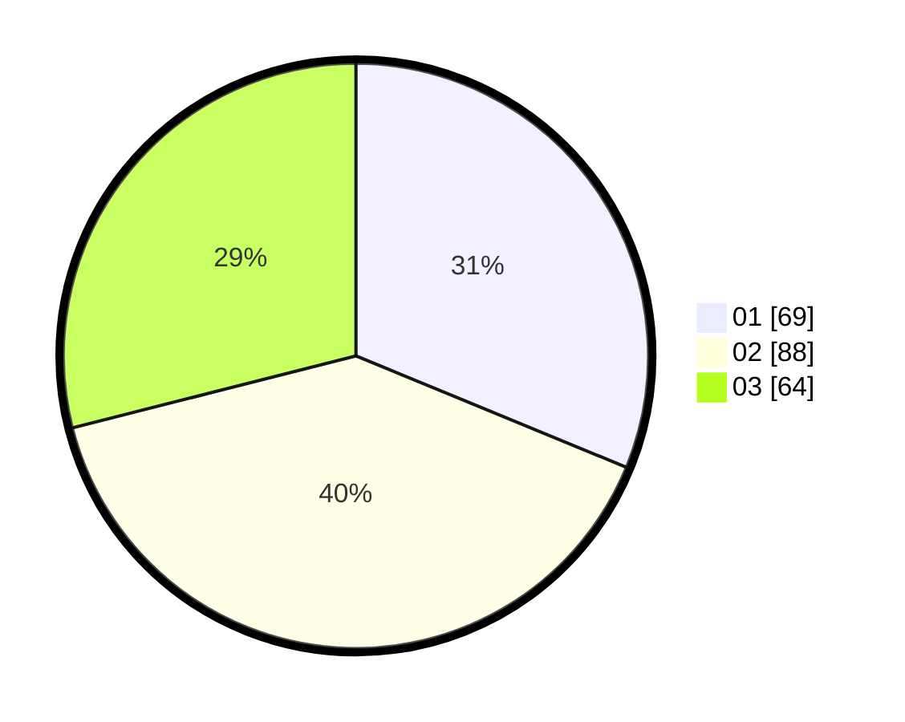

# Hasil

Hasil perolehan suara paslon dapat dilihat pada file paslon-01.txt, paslon-02.txt, dan paslon-03.txt.

Jika tidak ada, artinya data tersebut belum ada pada SIREKAP.

## Perolehan Suara

 * Paslon 01: **69**.
 * Paslon 02: **88**.
 * Paslon 03: **64**.

## Foto C Plano

https://sirekap-obj-formc.kpu.go.id/c6a5/pemilu/ppwp/31/71/05/10/01/3171051001049-20240216-013756--3d3828f5-59f8-4c8a-946b-ff930d5931bc.jpg

https://sirekap-obj-formc.kpu.go.id/c6a5/pemilu/ppwp/31/71/05/10/01/3171051001049-20240216-013802--5af2afa1-9bc3-4f23-aa48-d5649a9142f0.jpg

https://sirekap-obj-formc.kpu.go.id/c6a5/pemilu/ppwp/31/71/05/10/01/3171051001049-20240216-013759--a20dc80e-a7d4-4943-b024-f4fe1837fd4e.jpg

## DATA PEMILIH TETAP

Jumlah pemilih dalam DPT: **0**.
 * L: **0**.
 * P: **0**.

## DATA PENGGUNA HAK PILIH

Jumlah pengguna hak pilih dalam DPT: **0**.
 * L: **0**.
 * P: **0**.

Jumlah pengguna hak pilih dalam DPTb: **0**.
 * L: **0**.
 * P: **0**.

Jumlah pengguna hak pilih dalam DPK: **0**.
 * L: **0**.
 * P: **0**.

Jumlah pengguna hak pilih: **0**.
 * L: **0**.
 * P: **0**.

## JUMLAH SUARA SAH DAN TIDAK SAH

JUMLAH SELURUH SUARA SAH: **221**.

JUMLAH SUARA TIDAK SAH: **4**.

JUMLAH SELURUH SUARA SAH DAN SUARA TIDAK SAH: **225**.
