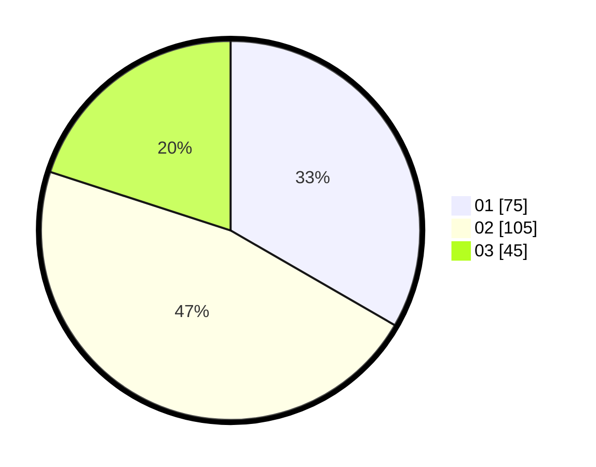

# Hasil

Hasil perolehan suara paslon dapat dilihat pada file paslon-01.txt, paslon-02.txt, dan paslon-03.txt.

Jika tidak ada, artinya data tersebut belum ada pada SIREKAP.

## Perolehan Suara

 * Paslon 01: **75**.
 * Paslon 02: **105**.
 * Paslon 03: **45**.

## Foto C Plano

https://sirekap-obj-formc.kpu.go.id/dbd3/pemilu/ppwp/31/71/05/10/01/3171051001054-20240216-121220--bc1ea1e8-4302-4ec5-9190-9a8817e777d9.jpg

https://sirekap-obj-formc.kpu.go.id/dbd3/pemilu/ppwp/31/71/05/10/01/3171051001054-20240216-121224--f93fa5d1-4955-40a9-876e-b854319338d4.jpg

https://sirekap-obj-formc.kpu.go.id/dbd3/pemilu/ppwp/31/71/05/10/01/3171051001054-20240216-121221--6db3993d-ad16-4114-a709-a3f474aa0d9e.jpg

## DATA PEMILIH TETAP

Jumlah pemilih dalam DPT: **283**.
 * L: **140**.
 * P: **143**.

## DATA PENGGUNA HAK PILIH

Jumlah pengguna hak pilih dalam DPT: **220**.
 * L: **104**.
 * P: **116**.

Jumlah pengguna hak pilih dalam DPTb: **7**.
 * L: **2**.
 * P: **5**.

Jumlah pengguna hak pilih dalam DPK: **0**.
 * L: **0**.
 * P: **0**.

Jumlah pengguna hak pilih: **227**.
 * L: **106**.
 * P: **121**.

## JUMLAH SUARA SAH DAN TIDAK SAH

JUMLAH SELURUH SUARA SAH: **225**.

JUMLAH SUARA TIDAK SAH: **2**.

JUMLAH SELURUH SUARA SAH DAN SUARA TIDAK SAH: **227**.
