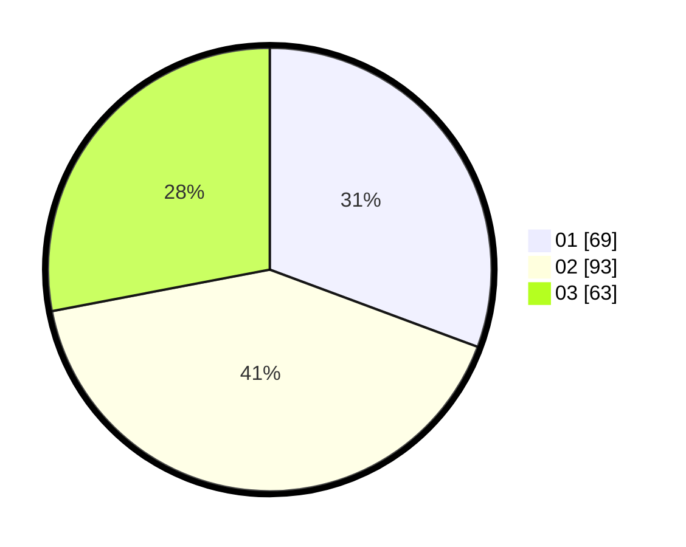

# Hasil

Hasil perolehan suara paslon dapat dilihat pada file paslon-01.txt, paslon-02.txt, dan paslon-03.txt.

Jika tidak ada, artinya data tersebut belum ada pada SIREKAP.

## Perolehan Suara

 * Paslon 01: **69**.
 * Paslon 02: **93**.
 * Paslon 03: **63**.

## Foto C Plano

https://sirekap-obj-formc.kpu.go.id/bc38/pemilu/ppwp/31/71/05/10/01/3171051001055-20240216-055214--50245983-ce23-47d5-ac54-405da535f215.jpg

https://sirekap-obj-formc.kpu.go.id/bc38/pemilu/ppwp/31/71/05/10/01/3171051001055-20240216-055218--f61f65bc-2756-4f37-a50e-fbe7a32033ef.jpg

https://sirekap-obj-formc.kpu.go.id/bc38/pemilu/ppwp/31/71/05/10/01/3171051001055-20240216-055217--e52b9d69-f913-4f99-9b99-f29d53f010d4.jpg

## DATA PEMILIH TETAP

Jumlah pemilih dalam DPT: **274**.
 * L: **133**.
 * P: **141**.

## DATA PENGGUNA HAK PILIH

Jumlah pengguna hak pilih dalam DPT: **209**.
 * L: **93**.
 * P: **116**.

Jumlah pengguna hak pilih dalam DPTb: **17**.
 * L: **5**.
 * P: **12**.

Jumlah pengguna hak pilih dalam DPK: **0**.
 * L: **0**.
 * P: **0**.

Jumlah pengguna hak pilih: **226**.
 * L: **98**.
 * P: **128**.

## JUMLAH SUARA SAH DAN TIDAK SAH

JUMLAH SELURUH SUARA SAH: **225**.

JUMLAH SUARA TIDAK SAH: **1**.

JUMLAH SELURUH SUARA SAH DAN SUARA TIDAK SAH: **226**.
