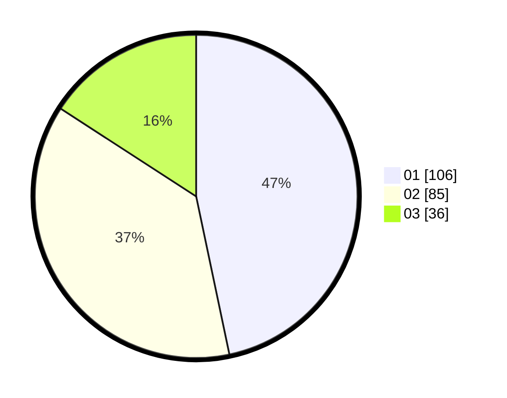

# Hasil

Hasil perolehan suara paslon dapat dilihat pada file paslon-01.txt, paslon-02.txt, dan paslon-03.txt.

Jika tidak ada, artinya data tersebut belum ada pada SIREKAP.

## Perolehan Suara

 * Paslon 01: **106**.
 * Paslon 02: **85**.
 * Paslon 03: **36**.

## Foto C Plano

https://sirekap-obj-formc.kpu.go.id/2d45/pemilu/ppwp/31/71/05/10/01/3171051001056-20240215-025609--31e32795-e2f8-4022-aa53-17a5a22e586a.jpg

https://sirekap-obj-formc.kpu.go.id/2d45/pemilu/ppwp/31/71/05/10/01/3171051001056-20240215-014024--31ccfcc1-ed38-4d29-beef-09cdc7b0be60.jpg

https://sirekap-obj-formc.kpu.go.id/2d45/pemilu/ppwp/31/71/05/10/01/3171051001056-20240215-025810--928ff50d-f4df-4650-b205-40ecb8b7d8e5.jpg

## DATA PEMILIH TETAP

Jumlah pemilih dalam DPT: **273**.
 * L: **135**.
 * P: **138**.

## DATA PENGGUNA HAK PILIH

Jumlah pengguna hak pilih dalam DPT: **222**.
 * L: **110**.
 * P: **112**.

Jumlah pengguna hak pilih dalam DPTb: **6**.
 * L: **2**.
 * P: **4**.

Jumlah pengguna hak pilih dalam DPK: **1**.
 * L: **0**.
 * P: **1**.

Jumlah pengguna hak pilih: **229**.
 * L: **112**.
 * P: **117**.

## JUMLAH SUARA SAH DAN TIDAK SAH

JUMLAH SELURUH SUARA SAH: **227**.

JUMLAH SUARA TIDAK SAH: **2**.

JUMLAH SELURUH SUARA SAH DAN SUARA TIDAK SAH: **229**.
