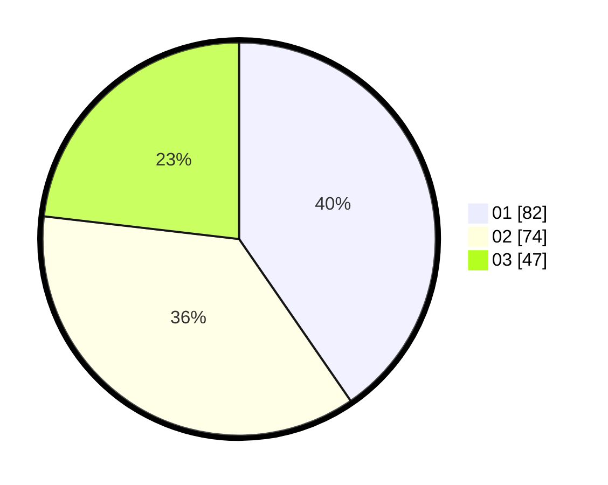

# Hasil

Hasil perolehan suara paslon dapat dilihat pada file paslon-01.txt, paslon-02.txt, dan paslon-03.txt.

Jika tidak ada, artinya data tersebut belum ada pada SIREKAP.

## Perolehan Suara

 * Paslon 01: **82**.
 * Paslon 02: **74**.
 * Paslon 03: **47**.

## Foto C Plano

https://sirekap-obj-formc.kpu.go.id/3a7e/pemilu/ppwp/31/71/05/10/01/3171051001065-20240214-204301--98680130-d4c4-477f-8db3-04943cc3402a.jpg

https://sirekap-obj-formc.kpu.go.id/3a7e/pemilu/ppwp/31/71/05/10/01/3171051001065-20240214-201520--8b0e9375-c39b-45b1-9d55-32b0af10e40c.jpg

https://sirekap-obj-formc.kpu.go.id/3a7e/pemilu/ppwp/31/71/05/10/01/3171051001065-20240214-201602--684c2f0e-26a3-4f93-83b7-562e1590cc06.jpg

## DATA PEMILIH TETAP

Jumlah pemilih dalam DPT: **249**.
 * L: **128**.
 * P: **121**.

## DATA PENGGUNA HAK PILIH

Jumlah pengguna hak pilih dalam DPT: **177**.
 * L: **85**.
 * P: **92**.

Jumlah pengguna hak pilih dalam DPTb: **19**.
 * L: **5**.
 * P: **14**.

Jumlah pengguna hak pilih dalam DPK: **8**.
 * L: **4**.
 * P: **4**.

Jumlah pengguna hak pilih: **204**.
 * L: **94**.
 * P: **106**.

## JUMLAH SUARA SAH DAN TIDAK SAH

JUMLAH SELURUH SUARA SAH: **203**.

JUMLAH SUARA TIDAK SAH: **1**.

JUMLAH SELURUH SUARA SAH DAN SUARA TIDAK SAH: **204**.
