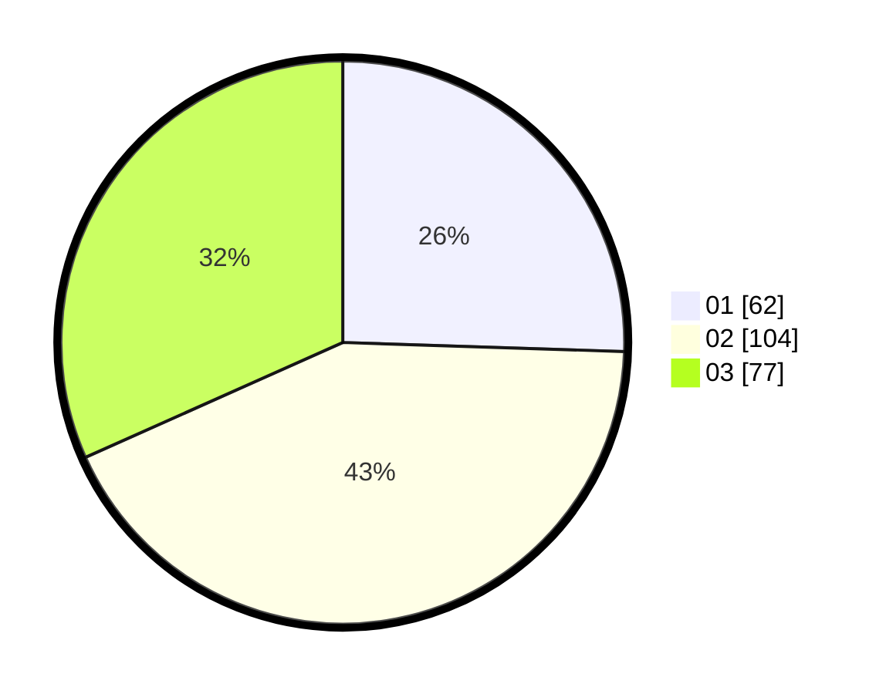

# Hasil

Hasil perolehan suara paslon dapat dilihat pada file paslon-01.txt, paslon-02.txt, dan paslon-03.txt.

Jika tidak ada, artinya data tersebut belum ada pada SIREKAP.

## Perolehan Suara

 * Paslon 01: **62**.
 * Paslon 02: **104**.
 * Paslon 03: **77**.

## Foto C Plano

https://sirekap-obj-formc.kpu.go.id/59ef/pemilu/ppwp/31/71/05/10/01/3171051001066-20240216-144921--751b9887-3723-428c-bb7f-46f2c54a34fb.jpg

https://sirekap-obj-formc.kpu.go.id/59ef/pemilu/ppwp/31/71/05/10/01/3171051001066-20240216-144922--914e65bb-ead9-4eaa-803f-687cd54ef87e.jpg

https://sirekap-obj-formc.kpu.go.id/59ef/pemilu/ppwp/31/71/05/10/01/3171051001066-20240216-144922--d9717699-1f16-4add-97ba-12bd9cc6d8a1.jpg

## DATA PEMILIH TETAP

Jumlah pemilih dalam DPT: **298**.
 * L: **152**.
 * P: **146**.

## DATA PENGGUNA HAK PILIH

Jumlah pengguna hak pilih dalam DPT: **231**.
 * L: **110**.
 * P: **121**.

Jumlah pengguna hak pilih dalam DPTb: **14**.
 * L: **5**.
 * P: **9**.

Jumlah pengguna hak pilih dalam DPK: **2**.
 * L: **0**.
 * P: **2**.

Jumlah pengguna hak pilih: **247**.
 * L: **115**.
 * P: **132**.

## JUMLAH SUARA SAH DAN TIDAK SAH

JUMLAH SELURUH SUARA SAH: **243**.

JUMLAH SUARA TIDAK SAH: **4**.

JUMLAH SELURUH SUARA SAH DAN SUARA TIDAK SAH: **247**.
