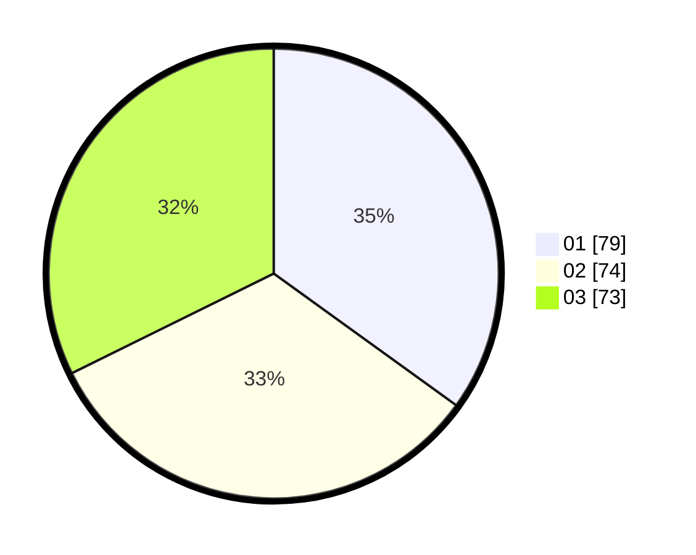

# Hasil

Hasil perolehan suara paslon dapat dilihat pada file paslon-01.txt, paslon-02.txt, dan paslon-03.txt.

Jika tidak ada, artinya data tersebut belum ada pada SIREKAP.

## Perolehan Suara

 * Paslon 01: **79**.
 * Paslon 02: **74**.
 * Paslon 03: **73**.

## Foto C Plano

https://sirekap-obj-formc.kpu.go.id/d7af/pemilu/ppwp/31/71/05/10/01/3171051001069-20240214-215351--9ab62a8d-ad9e-45f5-8473-9b22dca33798.jpg

https://sirekap-obj-formc.kpu.go.id/d7af/pemilu/ppwp/31/71/05/10/01/3171051001069-20240214-215441--b2e9e4b1-2c54-4bbd-bea2-09bad30e5259.jpg

https://sirekap-obj-formc.kpu.go.id/d7af/pemilu/ppwp/31/71/05/10/01/3171051001069-20240214-215520--06bbdd78-999b-4085-9cdc-d1ab410679dc.jpg

## DATA PEMILIH TETAP

Jumlah pemilih dalam DPT: **286**.
 * L: **139**.
 * P: **147**.

## DATA PENGGUNA HAK PILIH

Jumlah pengguna hak pilih dalam DPT: **203**.
 * L: **94**.
 * P: **109**.

Jumlah pengguna hak pilih dalam DPTb: **21**.
 * L: **13**.
 * P: **8**.

Jumlah pengguna hak pilih dalam DPK: **6**.
 * L: **4**.
 * P: **2**.

Jumlah pengguna hak pilih: **230**.
 * L: **111**.
 * P: **119**.

## JUMLAH SUARA SAH DAN TIDAK SAH

JUMLAH SELURUH SUARA SAH: **226**.

JUMLAH SUARA TIDAK SAH: **4**.

JUMLAH SELURUH SUARA SAH DAN SUARA TIDAK SAH: **230**.
