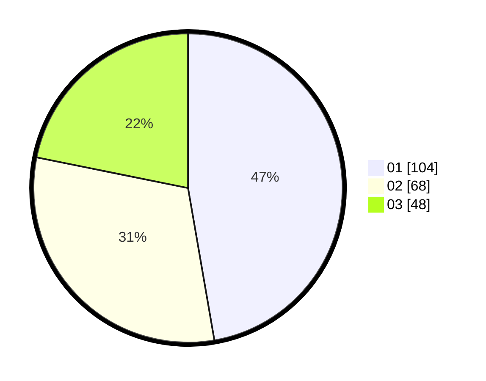

# Hasil

Hasil perolehan suara paslon dapat dilihat pada file paslon-01.txt, paslon-02.txt, dan paslon-03.txt.

Jika tidak ada, artinya data tersebut belum ada pada SIREKAP.

## Perolehan Suara

 * Paslon 01: **104**.
 * Paslon 02: **68**.
 * Paslon 03: **48**.

## Foto C Plano

https://sirekap-obj-formc.kpu.go.id/0953/pemilu/ppwp/31/71/05/10/01/3171051001070-20240214-193008--ba1c37a5-fa92-45e4-af19-785431d998b8.jpg

https://sirekap-obj-formc.kpu.go.id/0953/pemilu/ppwp/31/71/05/10/01/3171051001070-20240214-155334--42c9a74c-fae8-4edf-a1e6-38a368338b65.jpg

https://sirekap-obj-formc.kpu.go.id/0953/pemilu/ppwp/31/71/05/10/01/3171051001070-20240214-193227--2bae9f66-5da9-4025-8583-3a20414b1802.jpg

## DATA PEMILIH TETAP

Jumlah pemilih dalam DPT: **285**.
 * L: **128**.
 * P: **157**.

## DATA PENGGUNA HAK PILIH

Jumlah pengguna hak pilih dalam DPT: **204**.
 * L: **88**.
 * P: **116**.

Jumlah pengguna hak pilih dalam DPTb: **14**.
 * L: **6**.
 * P: **8**.

Jumlah pengguna hak pilih dalam DPK: **6**.
 * L: **1**.
 * P: **5**.

Jumlah pengguna hak pilih: **224**.
 * L: **95**.
 * P: **129**.

## JUMLAH SUARA SAH DAN TIDAK SAH

JUMLAH SELURUH SUARA SAH: **220**.

JUMLAH SUARA TIDAK SAH: **4**.

JUMLAH SELURUH SUARA SAH DAN SUARA TIDAK SAH: **224**.
