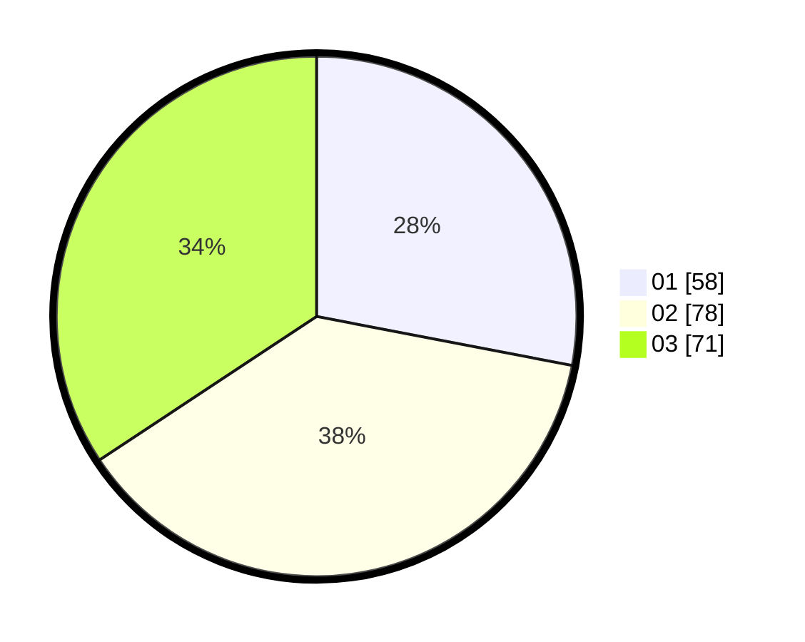

# Hasil

Hasil perolehan suara paslon dapat dilihat pada file paslon-01.txt, paslon-02.txt, dan paslon-03.txt.

Jika tidak ada, artinya data tersebut belum ada pada SIREKAP.

## Perolehan Suara

 * Paslon 01: **58**.
 * Paslon 02: **78**.
 * Paslon 03: **71**.

## Foto C Plano

https://sirekap-obj-formc.kpu.go.id/cd0a/pemilu/ppwp/31/71/05/10/01/3171051001071-20240216-054508--56f51eae-e80d-4d14-89a6-c3e4ad3ea5d0.jpg

https://sirekap-obj-formc.kpu.go.id/cd0a/pemilu/ppwp/31/71/05/10/01/3171051001071-20240216-054510--1c2451af-f663-4f69-adff-58d0a79d9933.jpg

https://sirekap-obj-formc.kpu.go.id/cd0a/pemilu/ppwp/31/71/05/10/01/3171051001071-20240216-054509--bdea64ab-7bfd-4f17-9a47-9f8ab8799ee4.jpg

## DATA PEMILIH TETAP

Jumlah pemilih dalam DPT: **292**.
 * L: **149**.
 * P: **143**.

## DATA PENGGUNA HAK PILIH

Jumlah pengguna hak pilih dalam DPT: **201**.
 * L: **95**.
 * P: **106**.

Jumlah pengguna hak pilih dalam DPTb: **9**.
 * L: **4**.
 * P: **5**.

Jumlah pengguna hak pilih dalam DPK: **2**.
 * L: **0**.
 * P: **2**.

Jumlah pengguna hak pilih: **212**.
 * L: **99**.
 * P: **113**.

## JUMLAH SUARA SAH DAN TIDAK SAH

JUMLAH SELURUH SUARA SAH: **207**.

JUMLAH SUARA TIDAK SAH: **5**.

JUMLAH SELURUH SUARA SAH DAN SUARA TIDAK SAH: **212**.
