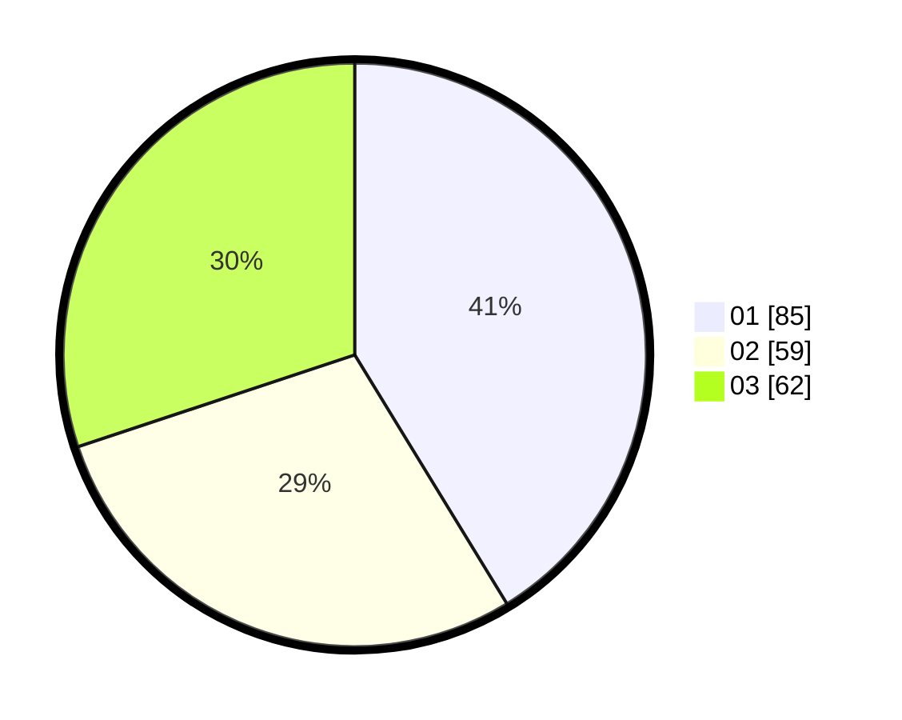

# Hasil

Hasil perolehan suara paslon dapat dilihat pada file paslon-01.txt, paslon-02.txt, dan paslon-03.txt.

Jika tidak ada, artinya data tersebut belum ada pada SIREKAP.

## Perolehan Suara

 * Paslon 01: **85**.
 * Paslon 02: **59**.
 * Paslon 03: **62**.

## Foto C Plano

https://sirekap-obj-formc.kpu.go.id/1524/pemilu/ppwp/31/71/05/10/01/3171051001073-20240216-062859--3fd0ced1-eb81-4e47-a5a2-352fd1c790e0.jpg

https://sirekap-obj-formc.kpu.go.id/1524/pemilu/ppwp/31/71/05/10/01/3171051001073-20240216-101547--86fe9ef8-d1c9-4f51-a492-08a8a511f721.jpg

https://sirekap-obj-formc.kpu.go.id/1524/pemilu/ppwp/31/71/05/10/01/3171051001073-20240216-062900--c8ab3087-e39d-45be-9262-ae47458fff59.jpg

## DATA PEMILIH TETAP

Jumlah pemilih dalam DPT: **269**.
 * L: **133**.
 * P: **136**.

## DATA PENGGUNA HAK PILIH

Jumlah pengguna hak pilih dalam DPT: **196**.
 * L: **94**.
 * P: **102**.

Jumlah pengguna hak pilih dalam DPTb: **11**.
 * L: **4**.
 * P: **7**.

Jumlah pengguna hak pilih dalam DPK: **2**.
 * L: **2**.
 * P: **0**.

Jumlah pengguna hak pilih: **209**.
 * L: **100**.
 * P: **109**.

## JUMLAH SUARA SAH DAN TIDAK SAH

JUMLAH SELURUH SUARA SAH: **206**.

JUMLAH SUARA TIDAK SAH: **3**.

JUMLAH SELURUH SUARA SAH DAN SUARA TIDAK SAH: **209**.
