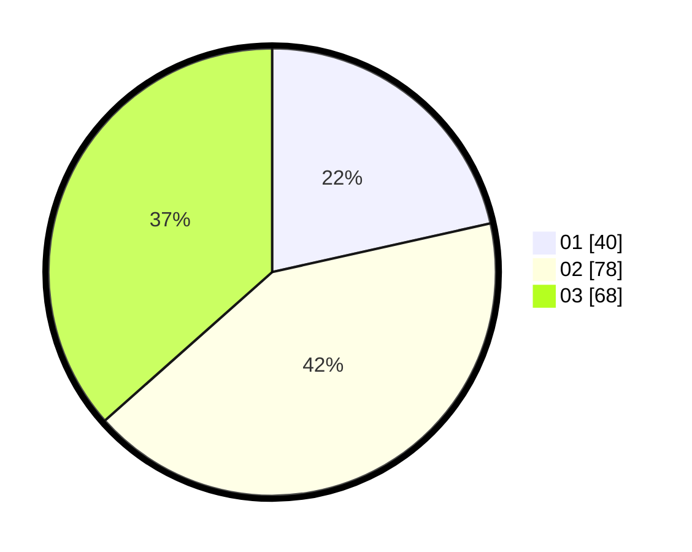

# Hasil

Hasil perolehan suara paslon dapat dilihat pada file paslon-01.txt, paslon-02.txt, dan paslon-03.txt.

Jika tidak ada, artinya data tersebut belum ada pada SIREKAP.

## Perolehan Suara

 * Paslon 01: **40**.
 * Paslon 02: **78**.
 * Paslon 03: **68**.

## Foto C Plano

https://sirekap-obj-formc.kpu.go.id/c721/pemilu/ppwp/31/71/05/10/01/3171051001078-20240214-190819--1ded28b6-a436-4292-b4cf-7b93f5170058.jpg

https://sirekap-obj-formc.kpu.go.id/c721/pemilu/ppwp/31/71/05/10/01/3171051001078-20240215-004015--0909a192-a4c3-446a-b271-1d4131f80cef.jpg

https://sirekap-obj-formc.kpu.go.id/c721/pemilu/ppwp/31/71/05/10/01/3171051001078-20240214-190830--74117da7-3894-4ab3-a632-a37946573297.jpg

## DATA PEMILIH TETAP

Jumlah pemilih dalam DPT: **248**.
 * L: **128**.
 * P: **120**.

## DATA PENGGUNA HAK PILIH

Jumlah pengguna hak pilih dalam DPT: **169**.
 * L: **90**.
 * P: **79**.

Jumlah pengguna hak pilih dalam DPTb: **6**.
 * L: **4**.
 * P: **2**.

Jumlah pengguna hak pilih dalam DPK: **3**.
 * L: **1**.
 * P: **2**.

Jumlah pengguna hak pilih: **178**.
 * L: **95**.
 * P: **83**.

## JUMLAH SUARA SAH DAN TIDAK SAH

JUMLAH SELURUH SUARA SAH: **186**.

JUMLAH SUARA TIDAK SAH: **1**.

JUMLAH SELURUH SUARA SAH DAN SUARA TIDAK SAH: **187**.
