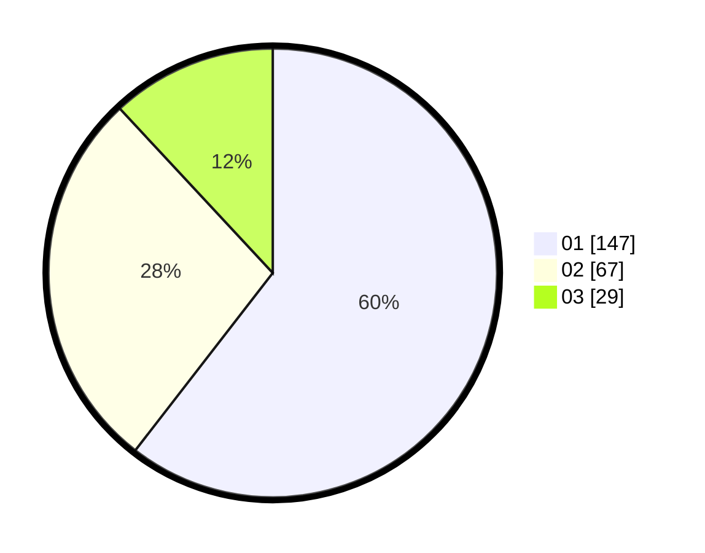

# Hasil

Hasil perolehan suara paslon dapat dilihat pada file paslon-01.txt, paslon-02.txt, dan paslon-03.txt.

Jika tidak ada, artinya data tersebut belum ada pada SIREKAP.

## Perolehan Suara

 * Paslon 01: **147**.
 * Paslon 02: **67**.
 * Paslon 03: **29**.

## Foto C Plano

https://sirekap-obj-formc.kpu.go.id/abd8/pemilu/ppwp/31/71/05/10/02/3171051002003-20240214-192833--d93303f9-a885-456c-86a4-b92d3145b924.jpg

https://sirekap-obj-formc.kpu.go.id/abd8/pemilu/ppwp/31/71/05/10/02/3171051002003-20240214-192917--53fecdcb-ae1c-4071-8926-f552607d2682.jpg

https://sirekap-obj-formc.kpu.go.id/abd8/pemilu/ppwp/31/71/05/10/02/3171051002003-20240214-193006--58c39e59-f5ec-446d-803d-43f1979baaf2.jpg

## DATA PEMILIH TETAP

Jumlah pemilih dalam DPT: **279**.
 * L: **139**.
 * P: **140**.

## DATA PENGGUNA HAK PILIH

Jumlah pengguna hak pilih dalam DPT: **219**.
 * L: **108**.
 * P: **111**.

Jumlah pengguna hak pilih dalam DPTb: **25**.
 * L: **9**.
 * P: **16**.

Jumlah pengguna hak pilih dalam DPK: **1**.
 * L: **1**.
 * P: **0**.

Jumlah pengguna hak pilih: **245**.
 * L: **118**.
 * P: **127**.

## JUMLAH SUARA SAH DAN TIDAK SAH

JUMLAH SELURUH SUARA SAH: **243**.

JUMLAH SUARA TIDAK SAH: **2**.

JUMLAH SELURUH SUARA SAH DAN SUARA TIDAK SAH: **245**.
