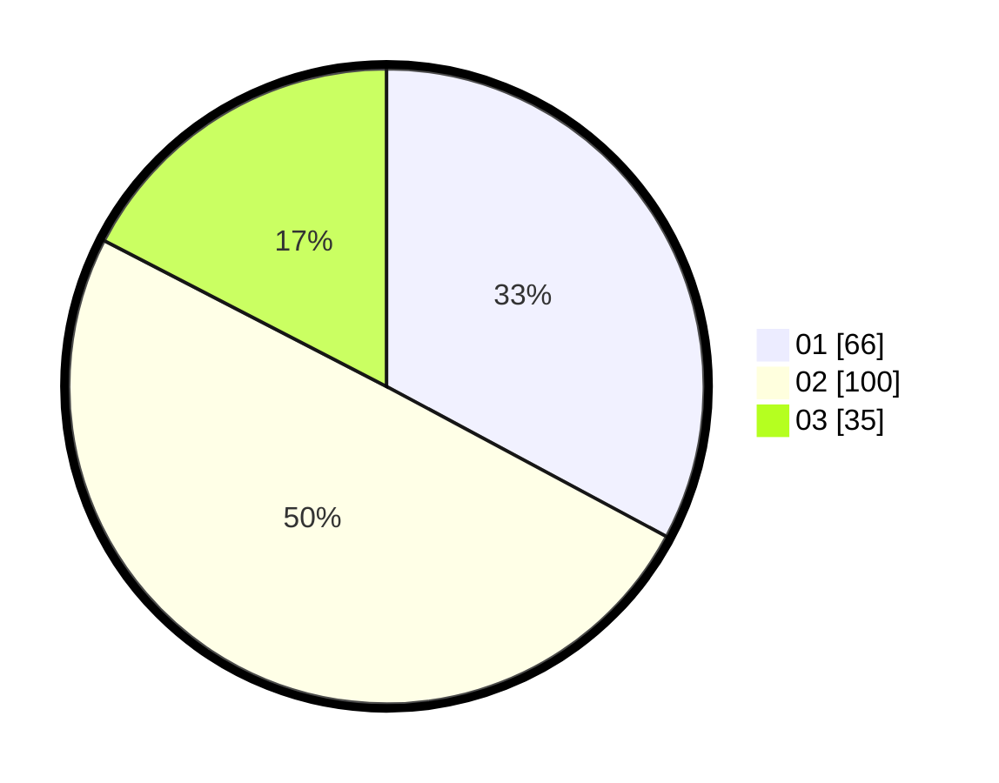

# Hasil

Hasil perolehan suara paslon dapat dilihat pada file paslon-01.txt, paslon-02.txt, dan paslon-03.txt.

Jika tidak ada, artinya data tersebut belum ada pada SIREKAP.

## Perolehan Suara

 * Paslon 01: **66**.
 * Paslon 02: **100**.
 * Paslon 03: **35**.

## Foto C Plano

https://sirekap-obj-formc.kpu.go.id/2b9e/pemilu/ppwp/31/71/05/10/02/3171051002004-20240214-155449--b76abc48-da11-4733-8e00-32ca5af40c0f.jpg

https://sirekap-obj-formc.kpu.go.id/2b9e/pemilu/ppwp/31/71/05/10/02/3171051002004-20240214-155315--d0935da1-7338-436f-b82d-47a90d5a478f.jpg

https://sirekap-obj-formc.kpu.go.id/2b9e/pemilu/ppwp/31/71/05/10/02/3171051002004-20240214-155155--e9ae7acd-9cc6-40df-8f53-3ed786a04fbe.jpg

## DATA PEMILIH TETAP

Jumlah pemilih dalam DPT: **271**.
 * L: **136**.
 * P: **135**.

## DATA PENGGUNA HAK PILIH

Jumlah pengguna hak pilih dalam DPT: **190**.
 * L: **96**.
 * P: **94**.

Jumlah pengguna hak pilih dalam DPTb: **18**.
 * L: **8**.
 * P: **10**.

Jumlah pengguna hak pilih dalam DPK: **0**.
 * L: **0**.
 * P: **0**.

Jumlah pengguna hak pilih: **208**.
 * L: **104**.
 * P: **104**.

## JUMLAH SUARA SAH DAN TIDAK SAH

JUMLAH SELURUH SUARA SAH: **201**.

JUMLAH SUARA TIDAK SAH: **7**.

JUMLAH SELURUH SUARA SAH DAN SUARA TIDAK SAH: **208**.
