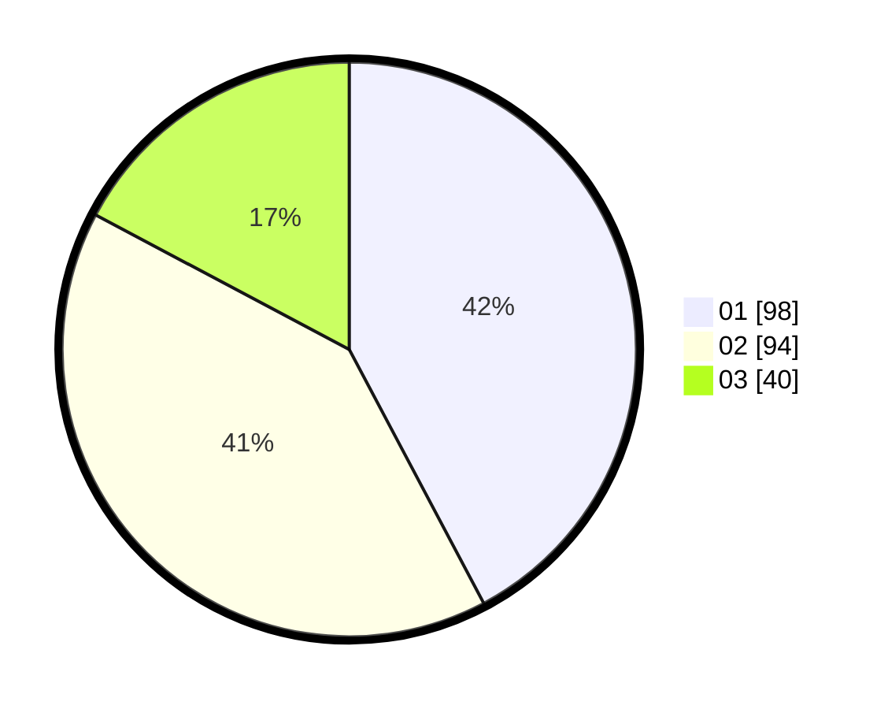

# Hasil

Hasil perolehan suara paslon dapat dilihat pada file paslon-01.txt, paslon-02.txt, dan paslon-03.txt.

Jika tidak ada, artinya data tersebut belum ada pada SIREKAP.

## Perolehan Suara

 * Paslon 01: **98**.
 * Paslon 02: **94**.
 * Paslon 03: **40**.

## Foto C Plano

https://sirekap-obj-formc.kpu.go.id/867a/pemilu/ppwp/31/71/05/10/02/3171051002005-20240215-044944--23c32d77-3748-4731-999d-5f4f9a9a992e.jpg

https://sirekap-obj-formc.kpu.go.id/867a/pemilu/ppwp/31/71/05/10/02/3171051002005-20240215-045059--b24c9599-21c9-457e-8578-d2e667702ce8.jpg

https://sirekap-obj-formc.kpu.go.id/867a/pemilu/ppwp/31/71/05/10/02/3171051002005-20240215-045156--623d204d-f27b-41b6-a053-447ae0c491b2.jpg

## DATA PEMILIH TETAP

Jumlah pemilih dalam DPT: **278**.
 * L: **139**.
 * P: **139**.

## DATA PENGGUNA HAK PILIH

Jumlah pengguna hak pilih dalam DPT: **206**.
 * L: **101**.
 * P: **105**.

Jumlah pengguna hak pilih dalam DPTb: **13**.
 * L: **9**.
 * P: **4**.

Jumlah pengguna hak pilih dalam DPK: **14**.
 * L: **7**.
 * P: **7**.

Jumlah pengguna hak pilih: **233**.
 * L: **117**.
 * P: **116**.

## JUMLAH SUARA SAH DAN TIDAK SAH

JUMLAH SELURUH SUARA SAH: **232**.

JUMLAH SUARA TIDAK SAH: **1**.

JUMLAH SELURUH SUARA SAH DAN SUARA TIDAK SAH: **233**.
