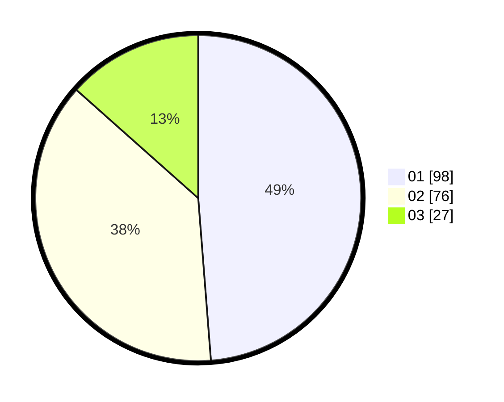

# Hasil

Hasil perolehan suara paslon dapat dilihat pada file paslon-01.txt, paslon-02.txt, dan paslon-03.txt.

Jika tidak ada, artinya data tersebut belum ada pada SIREKAP.

## Perolehan Suara

 * Paslon 01: **98**.
 * Paslon 02: **76**.
 * Paslon 03: **27**.

## Foto C Plano

https://sirekap-obj-formc.kpu.go.id/bf94/pemilu/ppwp/31/71/05/10/02/3171051002007-20240216-145758--c7e8307e-7e3c-454a-957a-ea3d7c557c1e.jpg

https://sirekap-obj-formc.kpu.go.id/bf94/pemilu/ppwp/31/71/05/10/02/3171051002007-20240216-145759--8d127100-485d-4352-982c-4a5c112b4ef9.jpg

https://sirekap-obj-formc.kpu.go.id/bf94/pemilu/ppwp/31/71/05/10/02/3171051002007-20240216-145759--dd774ae1-cfe1-4c55-b2b5-a08b6d70058b.jpg

## DATA PEMILIH TETAP

Jumlah pemilih dalam DPT: **274**.
 * L: **141**.
 * P: **133**.

## DATA PENGGUNA HAK PILIH

Jumlah pengguna hak pilih dalam DPT: **202**.
 * L: **106**.
 * P: **96**.

Jumlah pengguna hak pilih dalam DPTb: **3**.
 * L: **2**.
 * P: **1**.

Jumlah pengguna hak pilih dalam DPK: **0**.
 * L: **0**.
 * P: **0**.

Jumlah pengguna hak pilih: **205**.
 * L: **108**.
 * P: **97**.

## JUMLAH SUARA SAH DAN TIDAK SAH

JUMLAH SELURUH SUARA SAH: **201**.

JUMLAH SUARA TIDAK SAH: **4**.

JUMLAH SELURUH SUARA SAH DAN SUARA TIDAK SAH: **205**.
