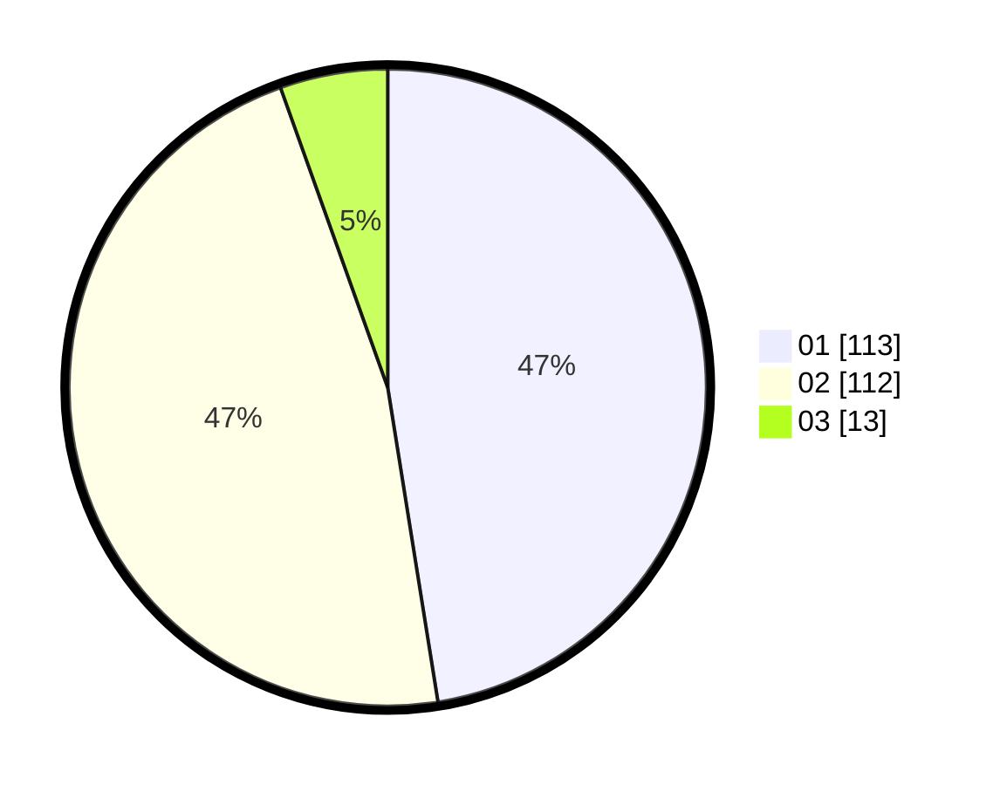

# Hasil

Hasil perolehan suara paslon dapat dilihat pada file paslon-01.txt, paslon-02.txt, dan paslon-03.txt.

Jika tidak ada, artinya data tersebut belum ada pada SIREKAP.

## Perolehan Suara

 * Paslon 01: **113**.
 * Paslon 02: **112**.
 * Paslon 03: **13**.

## Foto C Plano

https://sirekap-obj-formc.kpu.go.id/2371/pemilu/ppwp/31/71/05/10/02/3171051002011-20240214-201845--f0a474c2-81dd-431e-8385-202d849589bb.jpg

https://sirekap-obj-formc.kpu.go.id/2371/pemilu/ppwp/31/71/05/10/02/3171051002011-20240214-201954--277c9796-299a-4f97-809b-2406e5ddae97.jpg

https://sirekap-obj-formc.kpu.go.id/2371/pemilu/ppwp/31/71/05/10/02/3171051002011-20240214-202045--618f54f6-15fb-4599-9b8d-53940234a3b0.jpg

## DATA PEMILIH TETAP

Jumlah pemilih dalam DPT: **279**.
 * L: **140**.
 * P: **139**.

## DATA PENGGUNA HAK PILIH

Jumlah pengguna hak pilih dalam DPT: **232**.
 * L: **231**.
 * P: **125**.

Jumlah pengguna hak pilih dalam DPTb: **8**.
 * L: **7**.
 * P: **1**.

Jumlah pengguna hak pilih dalam DPK: **0**.
 * L: **0**.
 * P: **0**.

Jumlah pengguna hak pilih: **240**.
 * L: **118**.
 * P: **122**.

## JUMLAH SUARA SAH DAN TIDAK SAH

JUMLAH SELURUH SUARA SAH: **238**.

JUMLAH SUARA TIDAK SAH: **2**.

JUMLAH SELURUH SUARA SAH DAN SUARA TIDAK SAH: **240**.
