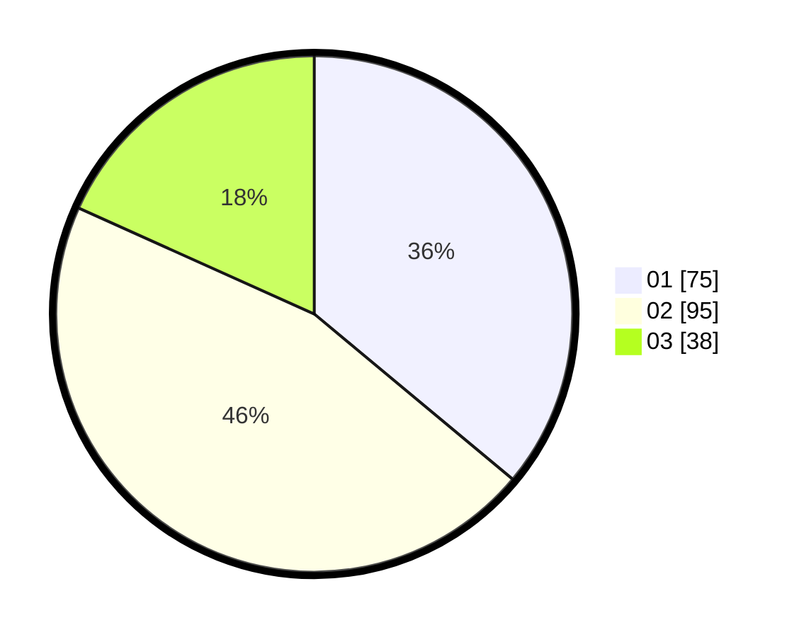

# Hasil

Hasil perolehan suara paslon dapat dilihat pada file paslon-01.txt, paslon-02.txt, dan paslon-03.txt.

Jika tidak ada, artinya data tersebut belum ada pada SIREKAP.

## Perolehan Suara

 * Paslon 01: **75**.
 * Paslon 02: **95**.
 * Paslon 03: **38**.

## Foto C Plano

https://sirekap-obj-formc.kpu.go.id/44b6/pemilu/ppwp/31/71/05/10/02/3171051002013-20240215-052950--2897a6bd-3fae-46f9-a823-56a8867abe31.jpg

https://sirekap-obj-formc.kpu.go.id/44b6/pemilu/ppwp/31/71/05/10/02/3171051002013-20240215-053011--6b8e9ee1-8bfe-4ae7-a642-90861131900d.jpg

https://sirekap-obj-formc.kpu.go.id/44b6/pemilu/ppwp/31/71/05/10/02/3171051002013-20240215-053000--aa1492be-39b0-4759-82ed-96f4e11929fe.jpg

## DATA PEMILIH TETAP

Jumlah pemilih dalam DPT: **286**.
 * L: **144**.
 * P: **142**.

## DATA PENGGUNA HAK PILIH

Jumlah pengguna hak pilih dalam DPT: **211**.
 * L: **98**.
 * P: **113**.

Jumlah pengguna hak pilih dalam DPTb: **2**.
 * L: **1**.
 * P: **1**.

Jumlah pengguna hak pilih dalam DPK: **0**.
 * L: **0**.
 * P: **0**.

Jumlah pengguna hak pilih: **213**.
 * L: **99**.
 * P: **114**.

## JUMLAH SUARA SAH DAN TIDAK SAH

JUMLAH SELURUH SUARA SAH: **208**.

JUMLAH SUARA TIDAK SAH: **5**.

JUMLAH SELURUH SUARA SAH DAN SUARA TIDAK SAH: **213**.
