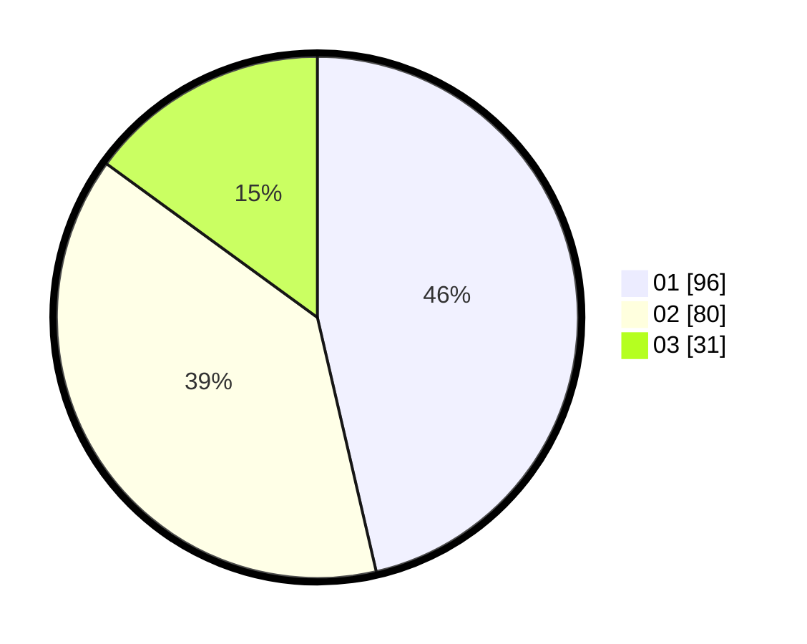

# Hasil

Hasil perolehan suara paslon dapat dilihat pada file paslon-01.txt, paslon-02.txt, dan paslon-03.txt.

Jika tidak ada, artinya data tersebut belum ada pada SIREKAP.

## Perolehan Suara

 * Paslon 01: **96**.
 * Paslon 02: **80**.
 * Paslon 03: **31**.

## Foto C Plano

https://sirekap-obj-formc.kpu.go.id/d5e3/pemilu/ppwp/31/71/05/10/02/3171051002016-20240216-091220--de2c5834-346d-4d0a-b189-52834a56e2a2.jpg

https://sirekap-obj-formc.kpu.go.id/d5e3/pemilu/ppwp/31/71/05/10/02/3171051002016-20240216-091222--d499a8a2-475e-40b7-8546-8769648a5ad2.jpg

https://sirekap-obj-formc.kpu.go.id/d5e3/pemilu/ppwp/31/71/05/10/02/3171051002016-20240216-091221--20bd43bb-ae90-4424-8d44-8a48f4c13768.jpg

## DATA PEMILIH TETAP

Jumlah pemilih dalam DPT: **288**.
 * L: **133**.
 * P: **155**.

## DATA PENGGUNA HAK PILIH

Jumlah pengguna hak pilih dalam DPT: **208**.
 * L: **94**.
 * P: **114**.

Jumlah pengguna hak pilih dalam DPTb: **0**.
 * L: **0**.
 * P: **0**.

Jumlah pengguna hak pilih dalam DPK: **1**.
 * L: **0**.
 * P: **1**.

Jumlah pengguna hak pilih: **209**.
 * L: **94**.
 * P: **115**.

## JUMLAH SUARA SAH DAN TIDAK SAH

JUMLAH SELURUH SUARA SAH: **207**.

JUMLAH SUARA TIDAK SAH: **2**.

JUMLAH SELURUH SUARA SAH DAN SUARA TIDAK SAH: **209**.
