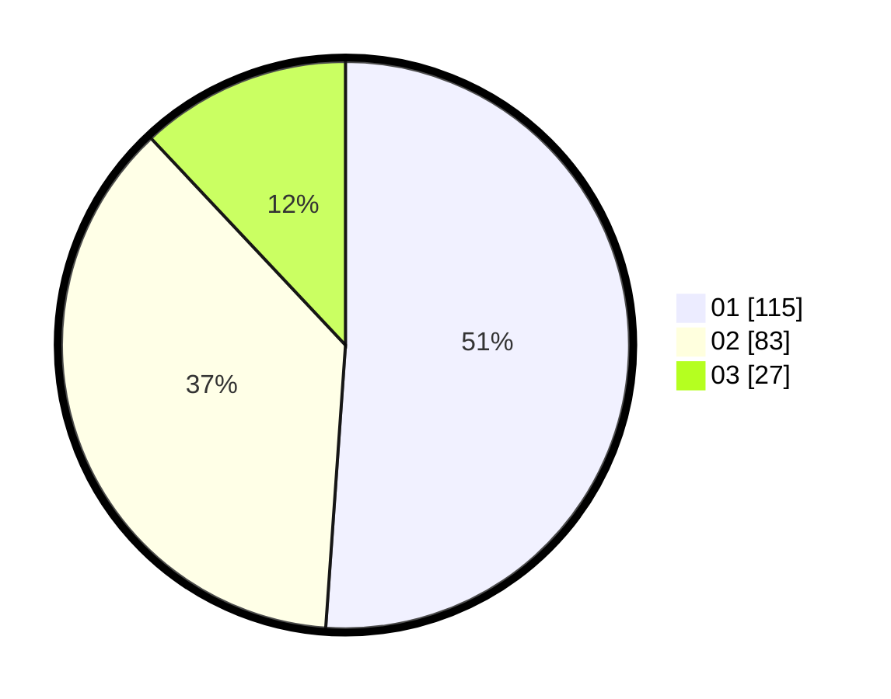

# Hasil

Hasil perolehan suara paslon dapat dilihat pada file paslon-01.txt, paslon-02.txt, dan paslon-03.txt.

Jika tidak ada, artinya data tersebut belum ada pada SIREKAP.

## Perolehan Suara

 * Paslon 01: **115**.
 * Paslon 02: **83**.
 * Paslon 03: **27**.

## Foto C Plano

https://sirekap-obj-formc.kpu.go.id/e426/pemilu/ppwp/31/71/05/10/02/3171051002021-20240216-144016--c7601d43-c3ca-40f1-ab1f-75365832c728.jpg

https://sirekap-obj-formc.kpu.go.id/e426/pemilu/ppwp/31/71/05/10/02/3171051002021-20240216-144018--8319efed-00ad-4fad-b988-3a3c433f06d9.jpg

https://sirekap-obj-formc.kpu.go.id/e426/pemilu/ppwp/31/71/05/10/02/3171051002021-20240216-144017--6ae75290-7c06-4b4f-a895-654a099c4226.jpg

## DATA PEMILIH TETAP

Jumlah pemilih dalam DPT: **284**.
 * L: **143**.
 * P: **141**.

## DATA PENGGUNA HAK PILIH

Jumlah pengguna hak pilih dalam DPT: **226**.
 * L: **113**.
 * P: **113**.

Jumlah pengguna hak pilih dalam DPTb: **1**.
 * L: **1**.
 * P: **0**.

Jumlah pengguna hak pilih dalam DPK: **1**.
 * L: **1**.
 * P: **0**.

Jumlah pengguna hak pilih: **228**.
 * L: **115**.
 * P: **113**.

## JUMLAH SUARA SAH DAN TIDAK SAH

JUMLAH SELURUH SUARA SAH: **225**.

JUMLAH SUARA TIDAK SAH: **3**.

JUMLAH SELURUH SUARA SAH DAN SUARA TIDAK SAH: **228**.
