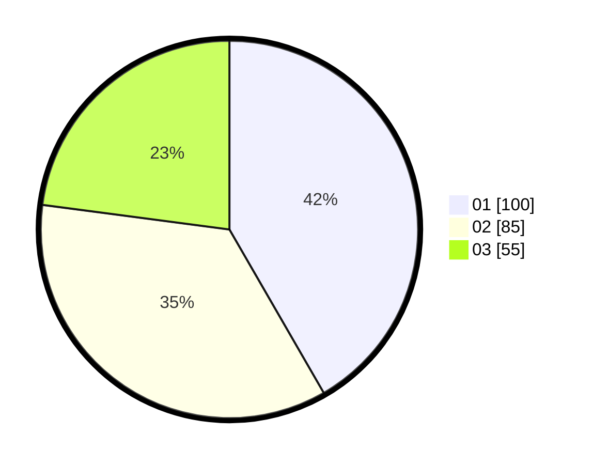

# Hasil

Hasil perolehan suara paslon dapat dilihat pada file paslon-01.txt, paslon-02.txt, dan paslon-03.txt.

Jika tidak ada, artinya data tersebut belum ada pada SIREKAP.

## Perolehan Suara

 * Paslon 01: **100**.
 * Paslon 02: **85**.
 * Paslon 03: **55**.

## Foto C Plano

https://sirekap-obj-formc.kpu.go.id/076b/pemilu/ppwp/31/71/05/10/02/3171051002023-20240214-220938--575be47a-1f02-495b-8a6b-7ef25291784f.jpg

https://sirekap-obj-formc.kpu.go.id/076b/pemilu/ppwp/31/71/05/10/02/3171051002023-20240214-221050--61242763-8959-4844-8995-df433cdc55d6.jpg

https://sirekap-obj-formc.kpu.go.id/076b/pemilu/ppwp/31/71/05/10/02/3171051002023-20240214-221134--18370699-b614-4bfd-b212-11dd6bcea9af.jpg

## DATA PEMILIH TETAP

Jumlah pemilih dalam DPT: **242**.
 * L: **99**.
 * P: **134**.

## DATA PENGGUNA HAK PILIH

Jumlah pengguna hak pilih dalam DPT: **218**.
 * L: **99**.
 * P: **119**.

Jumlah pengguna hak pilih dalam DPTb: **6**.
 * L: **5**.
 * P: **1**.

Jumlah pengguna hak pilih dalam DPK: **8**.
 * L: **4**.
 * P: **4**.

Jumlah pengguna hak pilih: **242**.
 * L: **108**.
 * P: **134**.

## JUMLAH SUARA SAH DAN TIDAK SAH

JUMLAH SELURUH SUARA SAH: **240**.

JUMLAH SUARA TIDAK SAH: **2**.

JUMLAH SELURUH SUARA SAH DAN SUARA TIDAK SAH: **242**.
