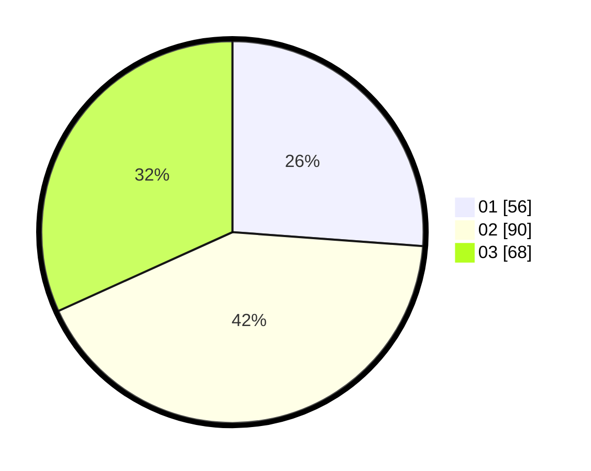

# Hasil

Hasil perolehan suara paslon dapat dilihat pada file paslon-01.txt, paslon-02.txt, dan paslon-03.txt.

Jika tidak ada, artinya data tersebut belum ada pada SIREKAP.

## Perolehan Suara

 * Paslon 01: **56**.
 * Paslon 02: **90**.
 * Paslon 03: **68**.

## Foto C Plano

https://sirekap-obj-formc.kpu.go.id/2984/pemilu/ppwp/31/71/05/10/02/3171051002026-20240216-140530--de4fb23f-6b46-433f-af5c-e5b87db9a4a0.jpg

https://sirekap-obj-formc.kpu.go.id/2984/pemilu/ppwp/31/71/05/10/02/3171051002026-20240216-140531--0f9c1648-17a8-40c4-b057-939ea2640249.jpg

https://sirekap-obj-formc.kpu.go.id/2984/pemilu/ppwp/31/71/05/10/02/3171051002026-20240216-140530--92073ad0-999c-49fe-aa01-7aaa1d217122.jpg

## DATA PEMILIH TETAP

Jumlah pemilih dalam DPT: **278**.
 * L: **132**.
 * P: **146**.

## DATA PENGGUNA HAK PILIH

Jumlah pengguna hak pilih dalam DPT: **203**.
 * L: **91**.
 * P: **112**.

Jumlah pengguna hak pilih dalam DPTb: **13**.
 * L: **5**.
 * P: **8**.

Jumlah pengguna hak pilih dalam DPK: **0**.
 * L: **0**.
 * P: **0**.

Jumlah pengguna hak pilih: **216**.
 * L: **96**.
 * P: **120**.

## JUMLAH SUARA SAH DAN TIDAK SAH

JUMLAH SELURUH SUARA SAH: **214**.

JUMLAH SUARA TIDAK SAH: **2**.

JUMLAH SELURUH SUARA SAH DAN SUARA TIDAK SAH: **216**.
