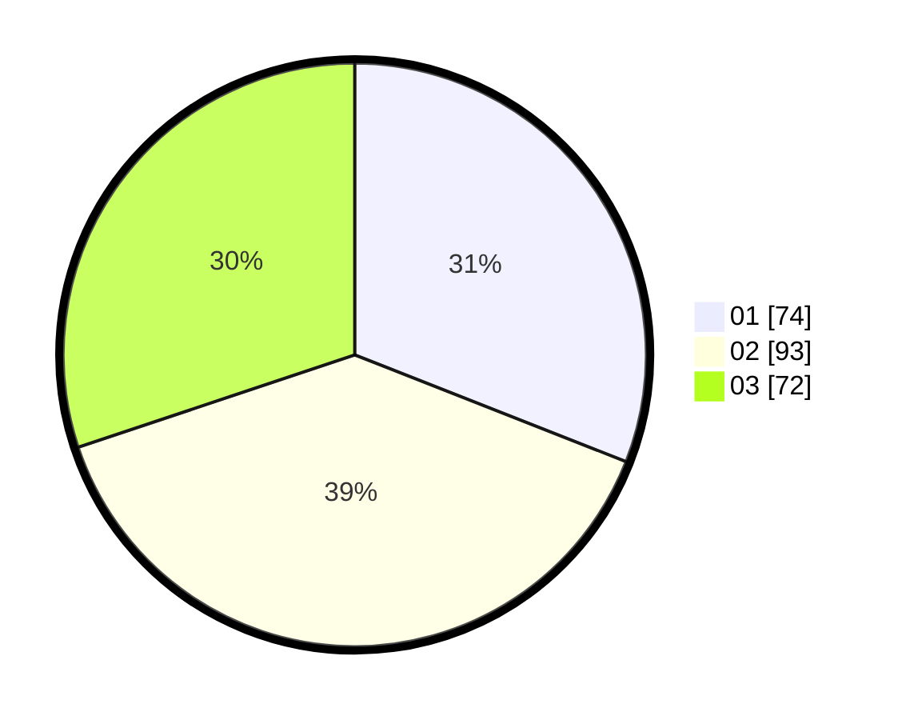

# Hasil

Hasil perolehan suara paslon dapat dilihat pada file paslon-01.txt, paslon-02.txt, dan paslon-03.txt.

Jika tidak ada, artinya data tersebut belum ada pada SIREKAP.

## Perolehan Suara

 * Paslon 01: **74**.
 * Paslon 02: **93**.
 * Paslon 03: **72**.

## Foto C Plano

https://sirekap-obj-formc.kpu.go.id/0383/pemilu/ppwp/31/71/05/10/02/3171051002027-20240214-233132--412c245a-a917-4b0a-b074-46e9b318420e.jpg

https://sirekap-obj-formc.kpu.go.id/0383/pemilu/ppwp/31/71/05/10/02/3171051002027-20240214-233326--0dedc6d7-fef1-4dff-8ebe-82ab3b1196d6.jpg

https://sirekap-obj-formc.kpu.go.id/0383/pemilu/ppwp/31/71/05/10/02/3171051002027-20240214-233402--ccf3ec28-3e0d-4292-8553-cbf4871cc972.jpg

## DATA PEMILIH TETAP

Jumlah pemilih dalam DPT: **290**.
 * L: **129**.
 * P: **161**.

## DATA PENGGUNA HAK PILIH

Jumlah pengguna hak pilih dalam DPT: **220**.
 * L: **94**.
 * P: **126**.

Jumlah pengguna hak pilih dalam DPTb: **18**.
 * L: **10**.
 * P: **8**.

Jumlah pengguna hak pilih dalam DPK: **1**.
 * L: **0**.
 * P: **1**.

Jumlah pengguna hak pilih: **239**.
 * L: **104**.
 * P: **135**.

## JUMLAH SUARA SAH DAN TIDAK SAH

JUMLAH SELURUH SUARA SAH: **239**.

JUMLAH SUARA TIDAK SAH: **0**.

JUMLAH SELURUH SUARA SAH DAN SUARA TIDAK SAH: **239**.
