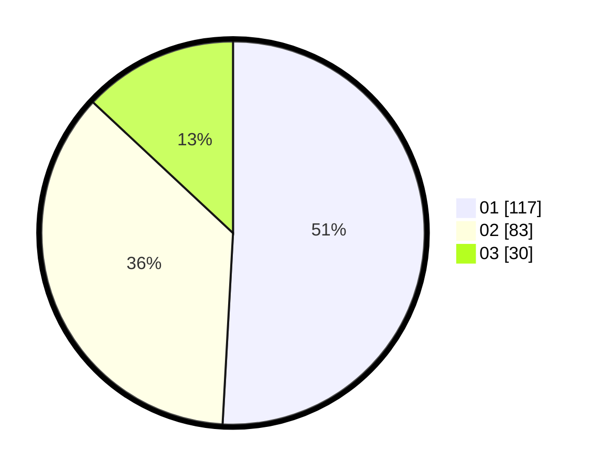

# Hasil

Hasil perolehan suara paslon dapat dilihat pada file paslon-01.txt, paslon-02.txt, dan paslon-03.txt.

Jika tidak ada, artinya data tersebut belum ada pada SIREKAP.

## Perolehan Suara

 * Paslon 01: **117**.
 * Paslon 02: **83**.
 * Paslon 03: **30**.

## Foto C Plano

https://sirekap-obj-formc.kpu.go.id/a333/pemilu/ppwp/31/71/05/10/02/3171051002029-20240214-215536--6298ae6a-511d-422e-8736-549fb63b9833.jpg

https://sirekap-obj-formc.kpu.go.id/a333/pemilu/ppwp/31/71/05/10/02/3171051002029-20240214-220633--e455d584-955f-4967-b5bf-c10f29f52524.jpg

https://sirekap-obj-formc.kpu.go.id/a333/pemilu/ppwp/31/71/05/10/02/3171051002029-20240214-215917--af4ac2fa-d792-4e4e-952f-681fa7d11817.jpg

## DATA PEMILIH TETAP

Jumlah pemilih dalam DPT: **287**.
 * L: **142**.
 * P: **145**.

## DATA PENGGUNA HAK PILIH

Jumlah pengguna hak pilih dalam DPT: **222**.
 * L: **110**.
 * P: **112**.

Jumlah pengguna hak pilih dalam DPTb: **0**.
 * L: **0**.
 * P: **0**.

Jumlah pengguna hak pilih dalam DPK: **9**.
 * L: **3**.
 * P: **6**.

Jumlah pengguna hak pilih: **231**.
 * L: **113**.
 * P: **118**.

## JUMLAH SUARA SAH DAN TIDAK SAH

JUMLAH SELURUH SUARA SAH: **230**.

JUMLAH SUARA TIDAK SAH: **1**.

JUMLAH SELURUH SUARA SAH DAN SUARA TIDAK SAH: **231**.
