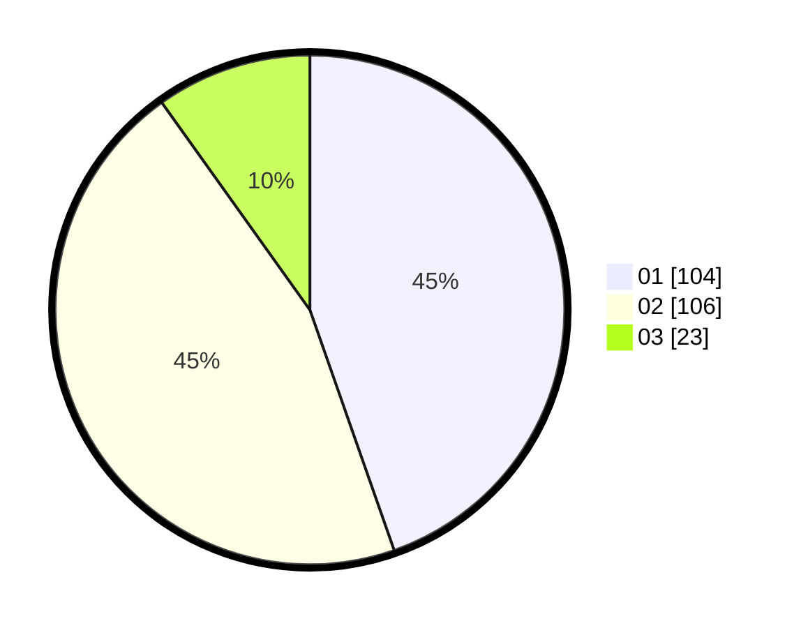

# Hasil

Hasil perolehan suara paslon dapat dilihat pada file paslon-01.txt, paslon-02.txt, dan paslon-03.txt.

Jika tidak ada, artinya data tersebut belum ada pada SIREKAP.

## Perolehan Suara

 * Paslon 01: **104**.
 * Paslon 02: **106**.
 * Paslon 03: **23**.

## Foto C Plano

https://sirekap-obj-formc.kpu.go.id/3fce/pemilu/ppwp/31/71/05/10/02/3171051002030-20240216-080323--702e7f34-e27a-4df1-8033-e0ceadaf4811.jpg

https://sirekap-obj-formc.kpu.go.id/3fce/pemilu/ppwp/31/71/05/10/02/3171051002030-20240216-080339--6f29a2d6-a203-49e3-a09a-fd9f44f8fef4.jpg

https://sirekap-obj-formc.kpu.go.id/3fce/pemilu/ppwp/31/71/05/10/02/3171051002030-20240216-080333--22bd0a18-01ab-48c4-a209-bf95abb5fb0d.jpg

## DATA PEMILIH TETAP

Jumlah pemilih dalam DPT: **290**.
 * L: **143**.
 * P: **147**.

## DATA PENGGUNA HAK PILIH

Jumlah pengguna hak pilih dalam DPT: **226**.
 * L: **110**.
 * P: **116**.

Jumlah pengguna hak pilih dalam DPTb: **1**.
 * L: **1**.
 * P: **0**.

Jumlah pengguna hak pilih dalam DPK: **9**.
 * L: **4**.
 * P: **5**.

Jumlah pengguna hak pilih: **236**.
 * L: **115**.
 * P: **121**.

## JUMLAH SUARA SAH DAN TIDAK SAH

JUMLAH SELURUH SUARA SAH: **233**.

JUMLAH SUARA TIDAK SAH: **3**.

JUMLAH SELURUH SUARA SAH DAN SUARA TIDAK SAH: **236**.
