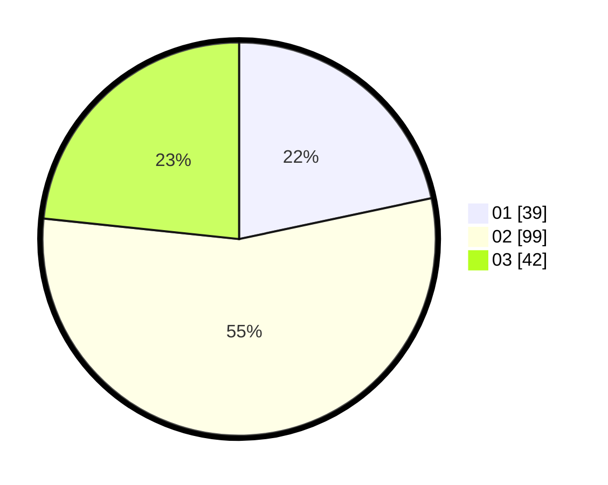

# Hasil

Hasil perolehan suara paslon dapat dilihat pada file paslon-01.txt, paslon-02.txt, dan paslon-03.txt.

Jika tidak ada, artinya data tersebut belum ada pada SIREKAP.

## Perolehan Suara

 * Paslon 01: **39**.
 * Paslon 02: **99**.
 * Paslon 03: **42**.

## Foto C Plano

https://sirekap-obj-formc.kpu.go.id/c640/pemilu/ppwp/31/71/05/10/02/3171051002033-20240215-004806--a8538f82-7cf7-4087-b560-0b0ed0f6a658.jpg

https://sirekap-obj-formc.kpu.go.id/c640/pemilu/ppwp/31/71/05/10/02/3171051002033-20240215-004915--e8c2d143-b40a-47ca-9da5-ea4c8290ee7c.jpg

https://sirekap-obj-formc.kpu.go.id/c640/pemilu/ppwp/31/71/05/10/02/3171051002033-20240215-004956--ce2b7c5e-abcb-4213-b81e-1bf591164d32.jpg

## DATA PEMILIH TETAP

Jumlah pemilih dalam DPT: **260**.
 * L: **155**.
 * P: **105**.

## DATA PENGGUNA HAK PILIH

Jumlah pengguna hak pilih dalam DPT: **171**.
 * L: **87**.
 * P: **84**.

Jumlah pengguna hak pilih dalam DPTb: **2**.
 * L: **1**.
 * P: **1**.

Jumlah pengguna hak pilih dalam DPK: **11**.
 * L: **11**.
 * P: **0**.

Jumlah pengguna hak pilih: **184**.
 * L: **99**.
 * P: **85**.

## JUMLAH SUARA SAH DAN TIDAK SAH

JUMLAH SELURUH SUARA SAH: **180**.

JUMLAH SUARA TIDAK SAH: **4**.

JUMLAH SELURUH SUARA SAH DAN SUARA TIDAK SAH: **184**.
