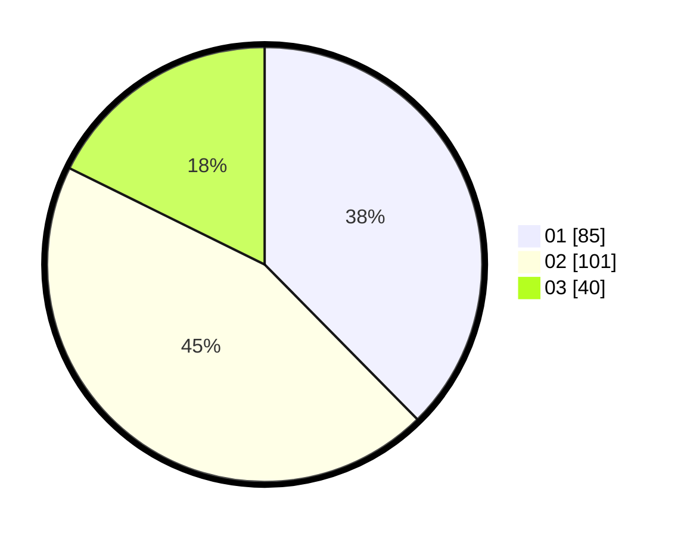

# Hasil

Hasil perolehan suara paslon dapat dilihat pada file paslon-01.txt, paslon-02.txt, dan paslon-03.txt.

Jika tidak ada, artinya data tersebut belum ada pada SIREKAP.

## Perolehan Suara

 * Paslon 01: **85**.
 * Paslon 02: **101**.
 * Paslon 03: **40**.

## Foto C Plano

https://sirekap-obj-formc.kpu.go.id/c00d/pemilu/ppwp/31/71/05/10/02/3171051002034-20240216-193700--9db445ff-184b-4ca6-a21f-de6ff7434214.jpg

https://sirekap-obj-formc.kpu.go.id/c00d/pemilu/ppwp/31/71/05/10/02/3171051002034-20240216-193702--431c5165-2a1f-481e-b3b6-b09375b72380.jpg

https://sirekap-obj-formc.kpu.go.id/c00d/pemilu/ppwp/31/71/05/10/02/3171051002034-20240216-193701--b4aa7a03-aaac-4c64-ad36-e53123d9bf63.jpg

## DATA PEMILIH TETAP

Jumlah pemilih dalam DPT: **268**.
 * L: **147**.
 * P: **121**.

## DATA PENGGUNA HAK PILIH

Jumlah pengguna hak pilih dalam DPT: **210**.
 * L: **96**.
 * P: **114**.

Jumlah pengguna hak pilih dalam DPTb: **18**.
 * L: **17**.
 * P: **1**.

Jumlah pengguna hak pilih dalam DPK: **3**.
 * L: **2**.
 * P: **1**.

Jumlah pengguna hak pilih: **231**.
 * L: **115**.
 * P: **116**.

## JUMLAH SUARA SAH DAN TIDAK SAH

JUMLAH SELURUH SUARA SAH: **226**.

JUMLAH SUARA TIDAK SAH: **5**.

JUMLAH SELURUH SUARA SAH DAN SUARA TIDAK SAH: **231**.
