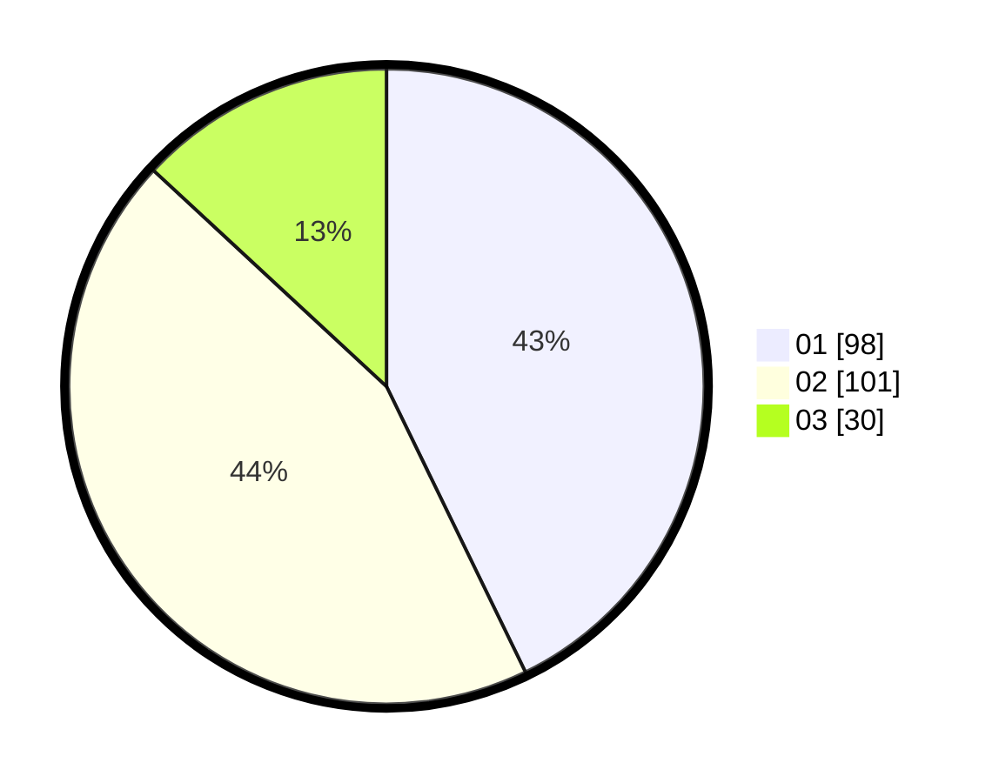

# Hasil

Hasil perolehan suara paslon dapat dilihat pada file paslon-01.txt, paslon-02.txt, dan paslon-03.txt.

Jika tidak ada, artinya data tersebut belum ada pada SIREKAP.

## Perolehan Suara

 * Paslon 01: **98**.
 * Paslon 02: **101**.
 * Paslon 03: **30**.

## Foto C Plano

https://sirekap-obj-formc.kpu.go.id/a077/pemilu/ppwp/31/71/05/10/02/3171051002035-20240215-001319--b81aaaf8-194b-46eb-8f3e-d61b6b5d9b9e.jpg

https://sirekap-obj-formc.kpu.go.id/a077/pemilu/ppwp/31/71/05/10/02/3171051002035-20240215-001416--dbb50810-cfa8-4c52-9245-954887479424.jpg

https://sirekap-obj-formc.kpu.go.id/a077/pemilu/ppwp/31/71/05/10/02/3171051002035-20240215-001503--0367ea81-f082-471e-890e-614700ea06d6.jpg

## DATA PEMILIH TETAP

Jumlah pemilih dalam DPT: **270**.
 * L: **133**.
 * P: **137**.

## DATA PENGGUNA HAK PILIH

Jumlah pengguna hak pilih dalam DPT: **217**.
 * L: **108**.
 * P: **109**.

Jumlah pengguna hak pilih dalam DPTb: **13**.
 * L: **8**.
 * P: **5**.

Jumlah pengguna hak pilih dalam DPK: **1**.
 * L: **0**.
 * P: **1**.

Jumlah pengguna hak pilih: **231**.
 * L: **116**.
 * P: **115**.

## JUMLAH SUARA SAH DAN TIDAK SAH

JUMLAH SELURUH SUARA SAH: **229**.

JUMLAH SUARA TIDAK SAH: **2**.

JUMLAH SELURUH SUARA SAH DAN SUARA TIDAK SAH: **231**.
