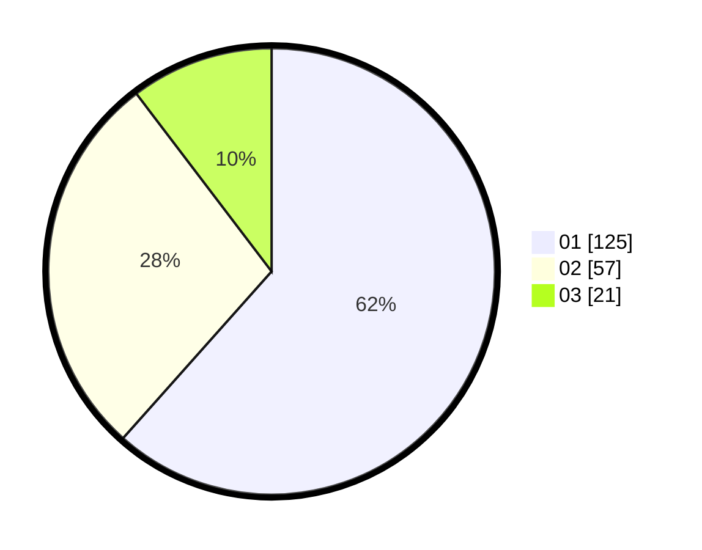

# Hasil

Hasil perolehan suara paslon dapat dilihat pada file paslon-01.txt, paslon-02.txt, dan paslon-03.txt.

Jika tidak ada, artinya data tersebut belum ada pada SIREKAP.

## Perolehan Suara

 * Paslon 01: **125**.
 * Paslon 02: **57**.
 * Paslon 03: **21**.

## Foto C Plano

https://sirekap-obj-formc.kpu.go.id/9ac5/pemilu/ppwp/31/71/05/10/02/3171051002041-20240216-020153--013af4d8-90b4-490f-9305-13a98af0b224.jpg

https://sirekap-obj-formc.kpu.go.id/9ac5/pemilu/ppwp/31/71/05/10/02/3171051002041-20240216-020213--abceae11-8f7d-4535-851e-a20d1b8c77fe.jpg

https://sirekap-obj-formc.kpu.go.id/9ac5/pemilu/ppwp/31/71/05/10/02/3171051002041-20240216-020203--37af551f-a4f6-47f3-ab61-352b9e2de801.jpg

## DATA PEMILIH TETAP

Jumlah pemilih dalam DPT: **279**.
 * L: **136**.
 * P: **143**.

## DATA PENGGUNA HAK PILIH

Jumlah pengguna hak pilih dalam DPT: **190**.
 * L: **88**.
 * P: **102**.

Jumlah pengguna hak pilih dalam DPTb: **4**.
 * L: **0**.
 * P: **4**.

Jumlah pengguna hak pilih dalam DPK: **9**.
 * L: **4**.
 * P: **5**.

Jumlah pengguna hak pilih: **203**.
 * L: **92**.
 * P: **111**.

## JUMLAH SUARA SAH DAN TIDAK SAH

JUMLAH SELURUH SUARA SAH: **203**.

JUMLAH SUARA TIDAK SAH: **1**.

JUMLAH SELURUH SUARA SAH DAN SUARA TIDAK SAH: **204**.
