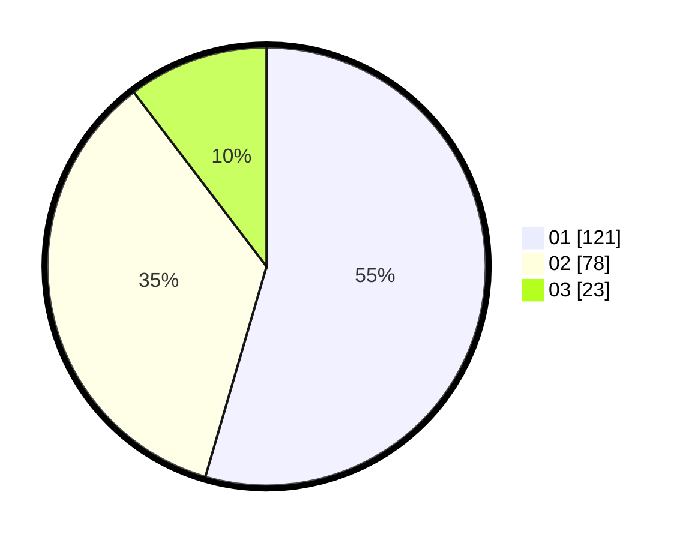

# Hasil

Hasil perolehan suara paslon dapat dilihat pada file paslon-01.txt, paslon-02.txt, dan paslon-03.txt.

Jika tidak ada, artinya data tersebut belum ada pada SIREKAP.

## Perolehan Suara

 * Paslon 01: **121**.
 * Paslon 02: **78**.
 * Paslon 03: **23**.

## Foto C Plano

https://sirekap-obj-formc.kpu.go.id/241a/pemilu/ppwp/31/71/05/10/02/3171051002045-20240214-202049--5ec65362-dd14-40e8-a1b2-7a73492321aa.jpg

https://sirekap-obj-formc.kpu.go.id/241a/pemilu/ppwp/31/71/05/10/02/3171051002045-20240214-202331--de25da60-7576-419d-83e3-82f846887df6.jpg

https://sirekap-obj-formc.kpu.go.id/241a/pemilu/ppwp/31/71/05/10/02/3171051002045-20240214-202455--b599ca74-b518-4960-ab26-29aea8cec4ee.jpg

## DATA PEMILIH TETAP

Jumlah pemilih dalam DPT: **265**.
 * L: **140**.
 * P: **125**.

## DATA PENGGUNA HAK PILIH

Jumlah pengguna hak pilih dalam DPT: **218**.
 * L: **113**.
 * P: **105**.

Jumlah pengguna hak pilih dalam DPTb: **3**.
 * L: **1**.
 * P: **2**.

Jumlah pengguna hak pilih dalam DPK: **2**.
 * L: **1**.
 * P: **1**.

Jumlah pengguna hak pilih: **223**.
 * L: **115**.
 * P: **108**.

## JUMLAH SUARA SAH DAN TIDAK SAH

JUMLAH SELURUH SUARA SAH: **222**.

JUMLAH SUARA TIDAK SAH: **1**.

JUMLAH SELURUH SUARA SAH DAN SUARA TIDAK SAH: **223**.
