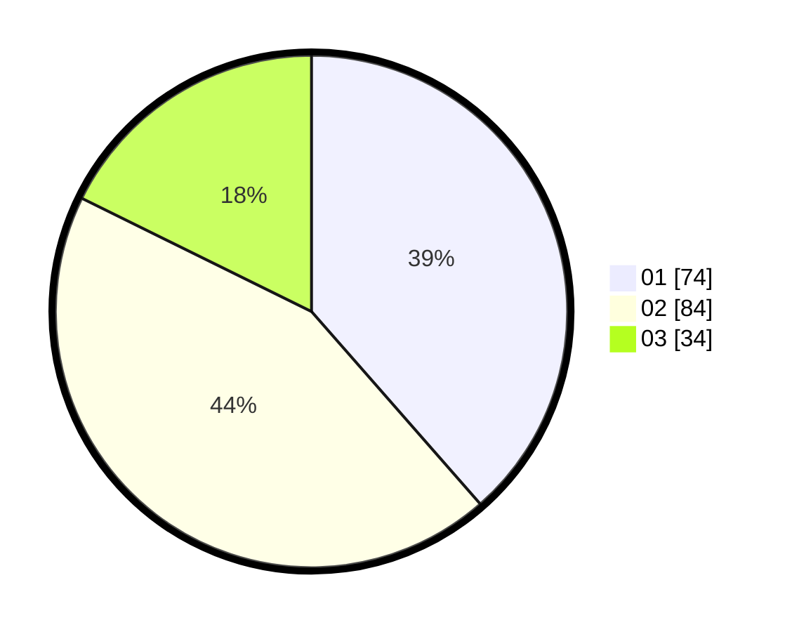

# Hasil

Hasil perolehan suara paslon dapat dilihat pada file paslon-01.txt, paslon-02.txt, dan paslon-03.txt.

Jika tidak ada, artinya data tersebut belum ada pada SIREKAP.

## Perolehan Suara

 * Paslon 01: **74**.
 * Paslon 02: **84**.
 * Paslon 03: **34**.

## Foto C Plano

https://sirekap-obj-formc.kpu.go.id/db98/pemilu/ppwp/31/71/05/10/02/3171051002051-20240215-045701--966c6278-d31b-4c50-af8d-c51c743fe3f9.jpg

https://sirekap-obj-formc.kpu.go.id/db98/pemilu/ppwp/31/71/05/10/02/3171051002051-20240215-050026--7c120f5b-9400-47f3-a711-545944f850fd.jpg

https://sirekap-obj-formc.kpu.go.id/db98/pemilu/ppwp/31/71/05/10/02/3171051002051-20240215-050221--a5264629-9e11-4290-abb1-74d97cd737a5.jpg

## DATA PEMILIH TETAP

Jumlah pemilih dalam DPT: **269**.
 * L: **118**.
 * P: **151**.

## DATA PENGGUNA HAK PILIH

Jumlah pengguna hak pilih dalam DPT: **192**.
 * L: **77**.
 * P: **113**.

Jumlah pengguna hak pilih dalam DPTb: **0**.
 * L: **0**.
 * P: **0**.

Jumlah pengguna hak pilih dalam DPK: **1**.
 * L: **1**.
 * P: **0**.

Jumlah pengguna hak pilih: **193**.
 * L: **78**.
 * P: **113**.

## JUMLAH SUARA SAH DAN TIDAK SAH

JUMLAH SELURUH SUARA SAH: **192**.

JUMLAH SUARA TIDAK SAH: **1**.

JUMLAH SELURUH SUARA SAH DAN SUARA TIDAK SAH: **193**.
