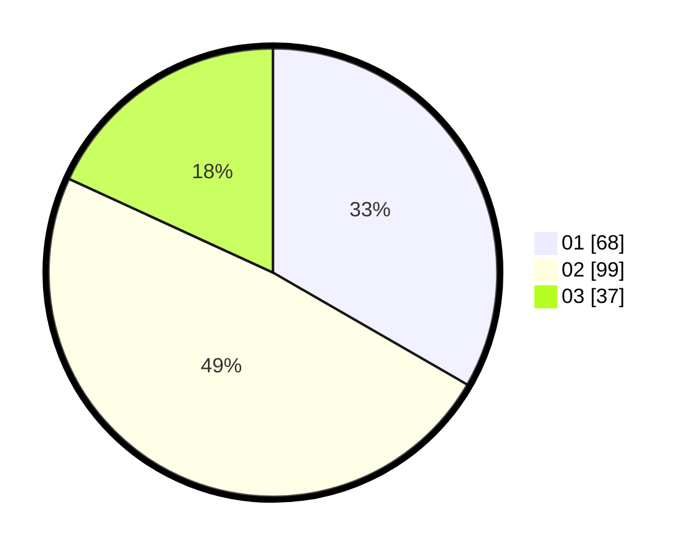

# Hasil

Hasil perolehan suara paslon dapat dilihat pada file paslon-01.txt, paslon-02.txt, dan paslon-03.txt.

Jika tidak ada, artinya data tersebut belum ada pada SIREKAP.

## Perolehan Suara

 * Paslon 01: **68**.
 * Paslon 02: **99**.
 * Paslon 03: **37**.

## Foto C Plano

https://sirekap-obj-formc.kpu.go.id/d3bd/pemilu/ppwp/31/71/05/10/02/3171051002052-20240218-100632--9732db19-56db-4e64-b87c-fe2e9d8eab04.jpg

https://sirekap-obj-formc.kpu.go.id/d3bd/pemilu/ppwp/31/71/05/10/02/3171051002052-20240218-100633--18888ea4-4533-4551-9ca2-600ad4778163.jpg

https://sirekap-obj-formc.kpu.go.id/d3bd/pemilu/ppwp/31/71/05/10/02/3171051002052-20240218-100633--2412256f-b65c-4d0e-8a9d-96e74abd576b.jpg

## DATA PEMILIH TETAP

Jumlah pemilih dalam DPT: **270**.
 * L: **138**.
 * P: **132**.

## DATA PENGGUNA HAK PILIH

Jumlah pengguna hak pilih dalam DPT: **206**.
 * L: **100**.
 * P: **106**.

Jumlah pengguna hak pilih dalam DPTb: **0**.
 * L: **0**.
 * P: **0**.

Jumlah pengguna hak pilih dalam DPK: **2**.
 * L: **0**.
 * P: **2**.

Jumlah pengguna hak pilih: **208**.
 * L: **100**.
 * P: **108**.

## JUMLAH SUARA SAH DAN TIDAK SAH

JUMLAH SELURUH SUARA SAH: **204**.

JUMLAH SUARA TIDAK SAH: **4**.

JUMLAH SELURUH SUARA SAH DAN SUARA TIDAK SAH: **208**.
