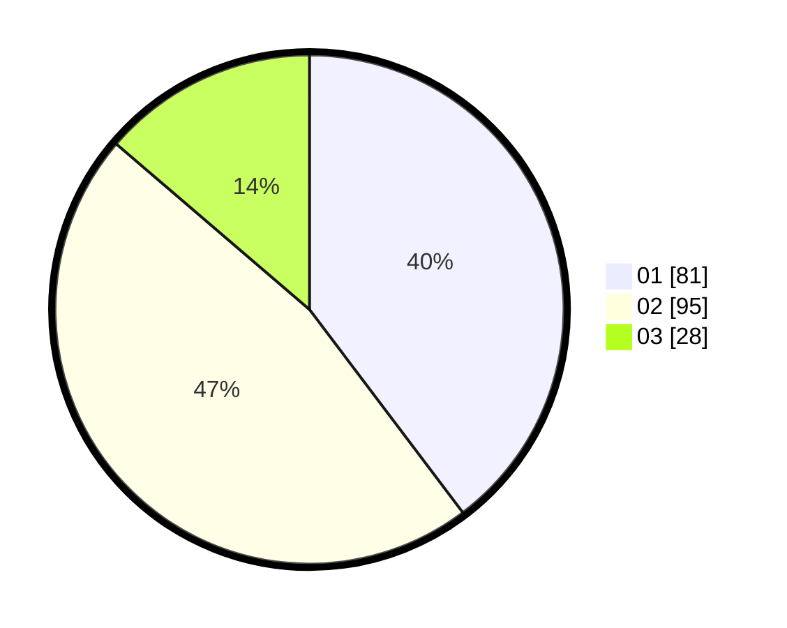

# Hasil

Hasil perolehan suara paslon dapat dilihat pada file paslon-01.txt, paslon-02.txt, dan paslon-03.txt.

Jika tidak ada, artinya data tersebut belum ada pada SIREKAP.

## Perolehan Suara

 * Paslon 01: **81**.
 * Paslon 02: **95**.
 * Paslon 03: **28**.

## Foto C Plano

https://sirekap-obj-formc.kpu.go.id/e4e1/pemilu/ppwp/31/71/05/10/02/3171051002054-20240216-063518--f0e4ca37-dac5-467a-8ebf-5e716f04dc26.jpg

https://sirekap-obj-formc.kpu.go.id/e4e1/pemilu/ppwp/31/71/05/10/02/3171051002054-20240216-063523--f2451880-57d7-4d60-ad50-7af6f5944678.jpg

https://sirekap-obj-formc.kpu.go.id/e4e1/pemilu/ppwp/31/71/05/10/02/3171051002054-20240216-063523--1578a320-82dc-4408-b5f0-720fd97c627d.jpg

## DATA PEMILIH TETAP

Jumlah pemilih dalam DPT: **263**.
 * L: **131**.
 * P: **132**.

## DATA PENGGUNA HAK PILIH

Jumlah pengguna hak pilih dalam DPT: **202**.
 * L: **93**.
 * P: **109**.

Jumlah pengguna hak pilih dalam DPTb: **2**.
 * L: **1**.
 * P: **1**.

Jumlah pengguna hak pilih dalam DPK: **2**.
 * L: **0**.
 * P: **2**.

Jumlah pengguna hak pilih: **206**.
 * L: **94**.
 * P: **112**.

## JUMLAH SUARA SAH DAN TIDAK SAH

JUMLAH SELURUH SUARA SAH: **204**.

JUMLAH SUARA TIDAK SAH: **2**.

JUMLAH SELURUH SUARA SAH DAN SUARA TIDAK SAH: **206**.
