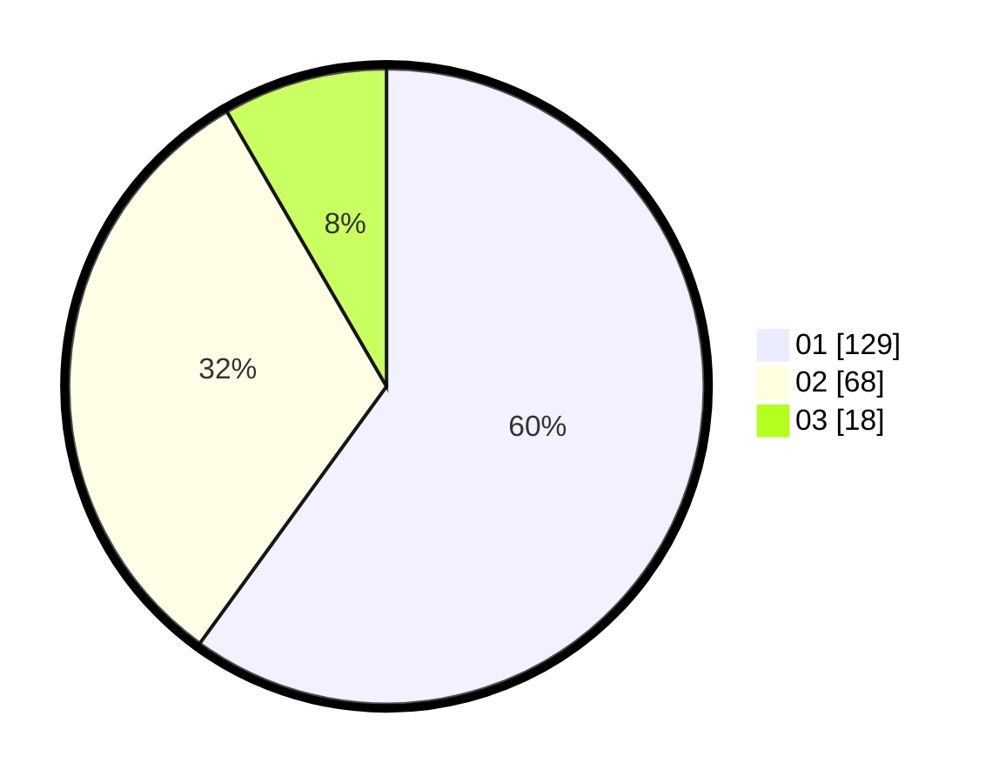

# Hasil

Hasil perolehan suara paslon dapat dilihat pada file paslon-01.txt, paslon-02.txt, dan paslon-03.txt.

Jika tidak ada, artinya data tersebut belum ada pada SIREKAP.

## Perolehan Suara

 * Paslon 01: **129**.
 * Paslon 02: **68**.
 * Paslon 03: **18**.

## Foto C Plano

https://sirekap-obj-formc.kpu.go.id/babd/pemilu/ppwp/31/71/05/10/02/3171051002055-20240214-234418--d6c5a9b7-920b-4565-b40d-d65198695b7f.jpg

https://sirekap-obj-formc.kpu.go.id/babd/pemilu/ppwp/31/71/05/10/02/3171051002055-20240214-234618--edd03630-0835-45c7-a0a0-dc2a91540580.jpg

https://sirekap-obj-formc.kpu.go.id/babd/pemilu/ppwp/31/71/05/10/02/3171051002055-20240214-234932--0581f014-249f-4b1c-83d7-8df3e19bb02e.jpg

## DATA PEMILIH TETAP

Jumlah pemilih dalam DPT: **244**.
 * L: **117**.
 * P: **127**.

## DATA PENGGUNA HAK PILIH

Jumlah pengguna hak pilih dalam DPT: **198**.
 * L: **91**.
 * P: **107**.

Jumlah pengguna hak pilih dalam DPTb: **15**.
 * L: **7**.
 * P: **8**.

Jumlah pengguna hak pilih dalam DPK: **4**.
 * L: **2**.
 * P: **2**.

Jumlah pengguna hak pilih: **218**.
 * L: **11**.
 * P: **117**.

## JUMLAH SUARA SAH DAN TIDAK SAH

JUMLAH SELURUH SUARA SAH: **213**.

JUMLAH SUARA TIDAK SAH: **5**.

JUMLAH SELURUH SUARA SAH DAN SUARA TIDAK SAH: **218**.
