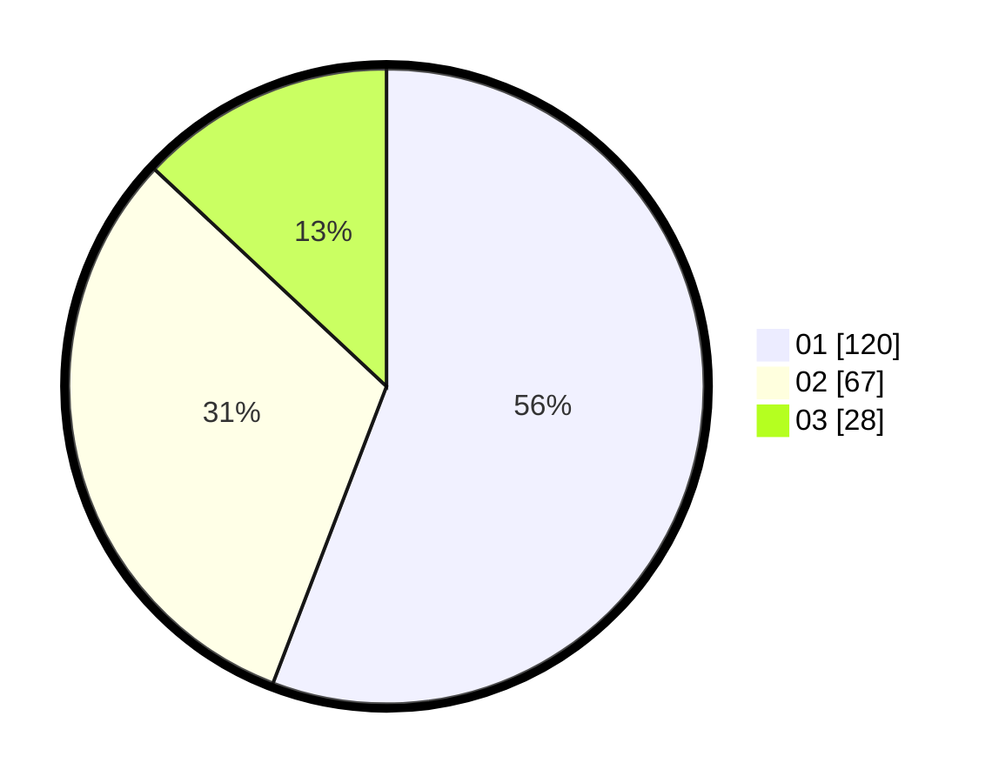

# Hasil

Hasil perolehan suara paslon dapat dilihat pada file paslon-01.txt, paslon-02.txt, dan paslon-03.txt.

Jika tidak ada, artinya data tersebut belum ada pada SIREKAP.

## Perolehan Suara

 * Paslon 01: **120**.
 * Paslon 02: **67**.
 * Paslon 03: **28**.

## Foto C Plano

https://sirekap-obj-formc.kpu.go.id/763c/pemilu/ppwp/31/71/05/10/02/3171051002058-20240214-215416--715b4cb5-1813-4751-bdf9-ce12039a3317.jpg

https://sirekap-obj-formc.kpu.go.id/763c/pemilu/ppwp/31/71/05/10/02/3171051002058-20240214-215519--47573d20-123b-4a97-9739-c232a35a0928.jpg

https://sirekap-obj-formc.kpu.go.id/763c/pemilu/ppwp/31/71/05/10/02/3171051002058-20240214-215645--ab0cf1ac-f82d-4457-b5dd-0a1066de527e.jpg

## DATA PEMILIH TETAP

Jumlah pemilih dalam DPT: **253**.
 * L: **118**.
 * P: **135**.

## DATA PENGGUNA HAK PILIH

Jumlah pengguna hak pilih dalam DPT: **213**.
 * L: **99**.
 * P: **114**.

Jumlah pengguna hak pilih dalam DPTb: **1**.
 * L: **0**.
 * P: **1**.

Jumlah pengguna hak pilih dalam DPK: **3**.
 * L: **1**.
 * P: **2**.

Jumlah pengguna hak pilih: **217**.
 * L: **100**.
 * P: **117**.

## JUMLAH SUARA SAH DAN TIDAK SAH

JUMLAH SELURUH SUARA SAH: **215**.

JUMLAH SUARA TIDAK SAH: **2**.

JUMLAH SELURUH SUARA SAH DAN SUARA TIDAK SAH: **217**.
