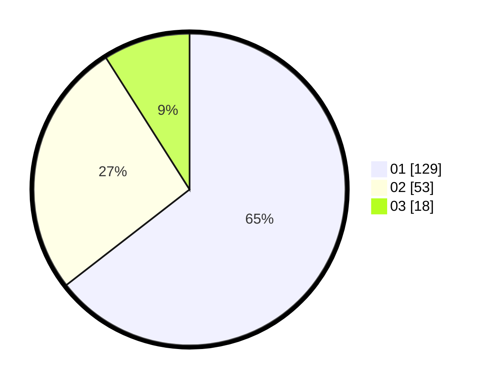

# Hasil

Hasil perolehan suara paslon dapat dilihat pada file paslon-01.txt, paslon-02.txt, dan paslon-03.txt.

Jika tidak ada, artinya data tersebut belum ada pada SIREKAP.

## Perolehan Suara

 * Paslon 01: **129**.
 * Paslon 02: **53**.
 * Paslon 03: **18**.

## Foto C Plano

https://sirekap-obj-formc.kpu.go.id/1527/pemilu/ppwp/31/71/05/10/02/3171051002059-20240216-021257--1dab8743-458e-4bba-a099-3a09cb088f5e.jpg

https://sirekap-obj-formc.kpu.go.id/1527/pemilu/ppwp/31/71/05/10/02/3171051002059-20240216-022510--456713e3-eecd-4056-9c53-83e45eb3f057.jpg

https://sirekap-obj-formc.kpu.go.id/1527/pemilu/ppwp/31/71/05/10/02/3171051002059-20240216-021306--0e3043bf-074f-460e-9e3a-5df315c6725e.jpg

## DATA PEMILIH TETAP

Jumlah pemilih dalam DPT: **238**.
 * L: **119**.
 * P: **119**.

## DATA PENGGUNA HAK PILIH

Jumlah pengguna hak pilih dalam DPT: **199**.
 * L: **102**.
 * P: **97**.

Jumlah pengguna hak pilih dalam DPTb: **1**.
 * L: **1**.
 * P: **0**.

Jumlah pengguna hak pilih dalam DPK: **2**.
 * L: **1**.
 * P: **1**.

Jumlah pengguna hak pilih: **202**.
 * L: **104**.
 * P: **98**.

## JUMLAH SUARA SAH DAN TIDAK SAH

JUMLAH SELURUH SUARA SAH: **200**.

JUMLAH SUARA TIDAK SAH: **2**.

JUMLAH SELURUH SUARA SAH DAN SUARA TIDAK SAH: **202**.
