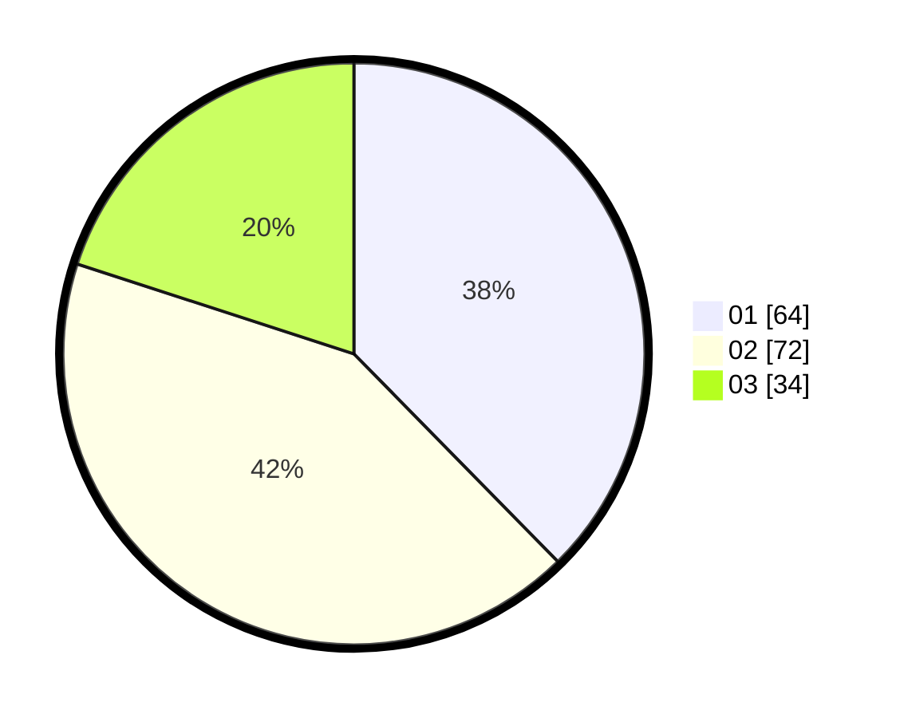

# Hasil

Hasil perolehan suara paslon dapat dilihat pada file paslon-01.txt, paslon-02.txt, dan paslon-03.txt.

Jika tidak ada, artinya data tersebut belum ada pada SIREKAP.

## Perolehan Suara

 * Paslon 01: **64**.
 * Paslon 02: **72**.
 * Paslon 03: **34**.

## Foto C Plano

https://sirekap-obj-formc.kpu.go.id/3be1/pemilu/ppwp/31/71/05/10/02/3171051002062-20240216-193223--6f4d4511-d816-4d2b-b59c-f5f4606dc192.jpg

https://sirekap-obj-formc.kpu.go.id/3be1/pemilu/ppwp/31/71/05/10/02/3171051002062-20240216-193225--d822409d-571f-458b-9aa1-682545119356.jpg

https://sirekap-obj-formc.kpu.go.id/3be1/pemilu/ppwp/31/71/05/10/02/3171051002062-20240216-193224--8498e245-3aa1-4cf3-98f3-b7f28a20fe89.jpg

## DATA PEMILIH TETAP

Jumlah pemilih dalam DPT: **236**.
 * L: **114**.
 * P: **122**.

## DATA PENGGUNA HAK PILIH

Jumlah pengguna hak pilih dalam DPT: **165**.
 * L: **77**.
 * P: **88**.

Jumlah pengguna hak pilih dalam DPTb: **2**.
 * L: **1**.
 * P: **1**.

Jumlah pengguna hak pilih dalam DPK: **6**.
 * L: **1**.
 * P: **5**.

Jumlah pengguna hak pilih: **173**.
 * L: **79**.
 * P: **94**.

## JUMLAH SUARA SAH DAN TIDAK SAH

JUMLAH SELURUH SUARA SAH: **170**.

JUMLAH SUARA TIDAK SAH: **3**.

JUMLAH SELURUH SUARA SAH DAN SUARA TIDAK SAH: **173**.
