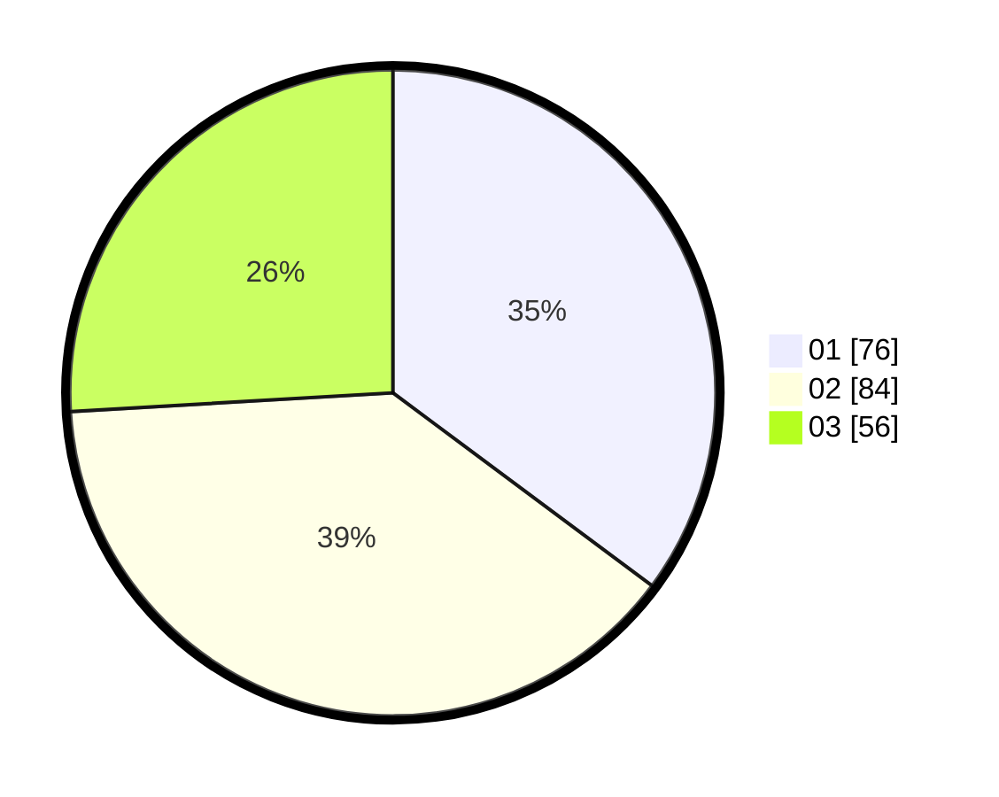

# Hasil

Hasil perolehan suara paslon dapat dilihat pada file paslon-01.txt, paslon-02.txt, dan paslon-03.txt.

Jika tidak ada, artinya data tersebut belum ada pada SIREKAP.

## Perolehan Suara

 * Paslon 01: **76**.
 * Paslon 02: **84**.
 * Paslon 03: **56**.

## Foto C Plano

https://sirekap-obj-formc.kpu.go.id/5b43/pemilu/ppwp/31/71/05/10/02/3171051002063-20240216-135151--5e00bcf5-c1a7-4e73-a1c7-5a0b49bc3bfd.jpg

https://sirekap-obj-formc.kpu.go.id/5b43/pemilu/ppwp/31/71/05/10/02/3171051002063-20240216-135152--674ce617-dcde-471f-a85c-0926e3b00c24.jpg

https://sirekap-obj-formc.kpu.go.id/5b43/pemilu/ppwp/31/71/05/10/02/3171051002063-20240216-135152--57578274-2fb6-4ae8-b446-893e0e123d00.jpg

## DATA PEMILIH TETAP

Jumlah pemilih dalam DPT: **274**.
 * L: **143**.
 * P: **131**.

## DATA PENGGUNA HAK PILIH

Jumlah pengguna hak pilih dalam DPT: **209**.
 * L: **106**.
 * P: **103**.

Jumlah pengguna hak pilih dalam DPTb: **7**.
 * L: **0**.
 * P: **7**.

Jumlah pengguna hak pilih dalam DPK: **1**.
 * L: **0**.
 * P: **1**.

Jumlah pengguna hak pilih: **217**.
 * L: **106**.
 * P: **111**.

## JUMLAH SUARA SAH DAN TIDAK SAH

JUMLAH SELURUH SUARA SAH: **216**.

JUMLAH SUARA TIDAK SAH: **2**.

JUMLAH SELURUH SUARA SAH DAN SUARA TIDAK SAH: **218**.
