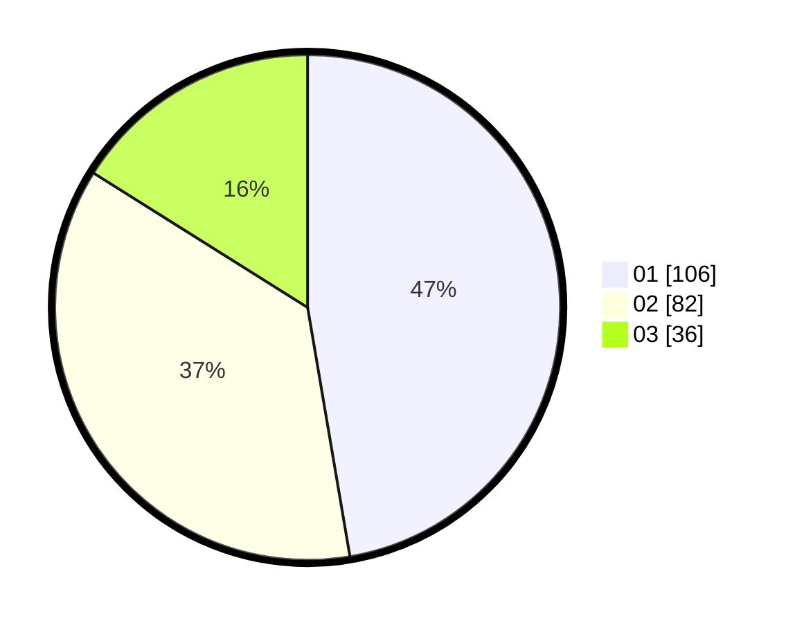

# Hasil

Hasil perolehan suara paslon dapat dilihat pada file paslon-01.txt, paslon-02.txt, dan paslon-03.txt.

Jika tidak ada, artinya data tersebut belum ada pada SIREKAP.

## Perolehan Suara

 * Paslon 01: **106**.
 * Paslon 02: **82**.
 * Paslon 03: **36**.

## Foto C Plano

https://sirekap-obj-formc.kpu.go.id/8b59/pemilu/ppwp/31/71/05/10/02/3171051002067-20240216-002112--7ac190fa-909b-41e6-b763-db5f79dc789b.jpg

https://sirekap-obj-formc.kpu.go.id/8b59/pemilu/ppwp/31/71/05/10/02/3171051002067-20240216-002115--24758ea1-e909-4893-ba2e-49707f9eed83.jpg

https://sirekap-obj-formc.kpu.go.id/8b59/pemilu/ppwp/31/71/05/10/02/3171051002067-20240216-002113--5343bc90-3a3e-417f-9cba-552441184db9.jpg

## DATA PEMILIH TETAP

Jumlah pemilih dalam DPT: **275**.
 * L: **129**.
 * P: **146**.

## DATA PENGGUNA HAK PILIH

Jumlah pengguna hak pilih dalam DPT: **225**.
 * L: **106**.
 * P: **119**.

Jumlah pengguna hak pilih dalam DPTb: **2**.
 * L: **1**.
 * P: **1**.

Jumlah pengguna hak pilih dalam DPK: **2**.
 * L: **0**.
 * P: **2**.

Jumlah pengguna hak pilih: **229**.
 * L: **107**.
 * P: **122**.

## JUMLAH SUARA SAH DAN TIDAK SAH

JUMLAH SELURUH SUARA SAH: **224**.

JUMLAH SUARA TIDAK SAH: **5**.

JUMLAH SELURUH SUARA SAH DAN SUARA TIDAK SAH: **229**.
