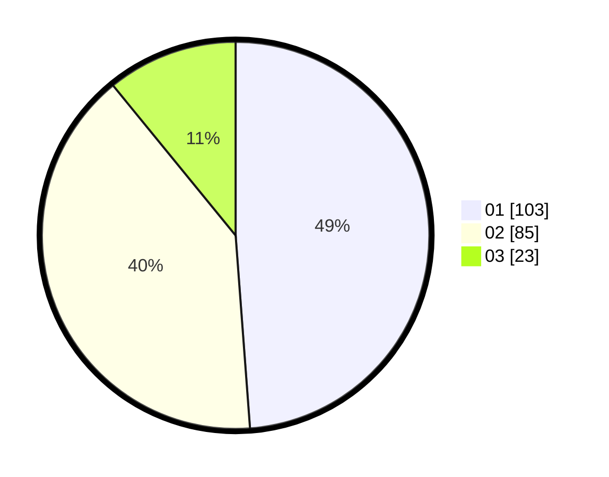

# Hasil

Hasil perolehan suara paslon dapat dilihat pada file paslon-01.txt, paslon-02.txt, dan paslon-03.txt.

Jika tidak ada, artinya data tersebut belum ada pada SIREKAP.

## Perolehan Suara

 * Paslon 01: **103**.
 * Paslon 02: **85**.
 * Paslon 03: **23**.

## Foto C Plano

https://sirekap-obj-formc.kpu.go.id/6432/pemilu/ppwp/31/71/05/10/02/3171051002071-20240214-190400--1a020ac8-01d4-40d5-acdc-110162e72167.jpg

https://sirekap-obj-formc.kpu.go.id/6432/pemilu/ppwp/31/71/05/10/02/3171051002071-20240214-190404--a293625b-b816-4c5d-8432-42a6a324e1fe.jpg

https://sirekap-obj-formc.kpu.go.id/6432/pemilu/ppwp/31/71/05/10/02/3171051002071-20240214-190409--f94942e6-b36d-465c-b1ec-0680815f4b44.jpg

## DATA PEMILIH TETAP

Jumlah pemilih dalam DPT: **284**.
 * L: **151**.
 * P: **133**.

## DATA PENGGUNA HAK PILIH

Jumlah pengguna hak pilih dalam DPT: **201**.
 * L: **102**.
 * P: **99**.

Jumlah pengguna hak pilih dalam DPTb: **10**.
 * L: **3**.
 * P: **7**.

Jumlah pengguna hak pilih dalam DPK: **2**.
 * L: **2**.
 * P: **0**.

Jumlah pengguna hak pilih: **213**.
 * L: **107**.
 * P: **106**.

## JUMLAH SUARA SAH DAN TIDAK SAH

JUMLAH SELURUH SUARA SAH: **211**.

JUMLAH SUARA TIDAK SAH: **2**.

JUMLAH SELURUH SUARA SAH DAN SUARA TIDAK SAH: **213**.
